<p align="center"></p>

<h1 align="center">DESIGN:OS</h1>

<p align="center"><b>Describe what you want in plain words — get production-grade, on-system UI back.</b></p>

<p align="center">
  [<a href="#quick-start">Quick start</a>] ·
  [<a href="#your-project-gets-a-staff--the-agents">Agents</a>] ·
  [<a href="#generated-by-designos">Generated examples</a>] ·
  [<a href="#the-agent-learns-in-the-work">Living proof</a>] ·
  [<a href="#advanced-motion-direction">Motion</a>] ·
  [<a href="#built-by-the-studio-behind-designos">Studio gallery</a>] ·
  [<a href="#workflow-map--current-generation-and-learning-loop">Workflow map</a>] ·
  [<a href="#the-machine-floor">The machine floor</a>] ·
  [<a href="#the-plugin--an-agent-and-a-designer-in-the-same-figma-file">The plugin</a>] ·
  [<a href="#the-figma-hand">The Figma hand</a>] ·
  [<a href="#changelog">Changelog</a>]
</p>

<p align="center"><sub>
Node ≥ 20 · MIT · zero-dependency <code>ui</code> kernel · 42 commands · 3,430 kernel tests green ·
a <a href="https://github.com/jangtrinh/design-os-figma-plugin">1,675-test Figma plugin</a> ·
26 personas · a 27-component kit · deterministic static + rendered gates · a 1:1 Figma mirror
</sub></p>

<p align="center"><code>npm install -g ease-design</code></p>

DESIGN:OS is a multi-runtime **design CLI**. You drive it through the agent CLI you
already use (Claude Code, Codex CLI, or Antigravity) with plain-language `/ui:*` commands.
The host model writes the HTML; DESIGN:OS supplies the taste — personas, a compiled
design system, and a hard quality gate the model cannot talk past. **No API keys, no
design tokens to hand-edit, no taste vocabulary to learn.**

---

## Generated by DESIGN:OS

Public sites shipped end to end with this toolchain. Every repo documents how to
reproduce it with DESIGN:OS — OPAH ONE walks it command by command. The grid grows as
new demos ship.

<table>
  <tr>
    <th align="left"><a href="https://jangtrinh.github.io/design-os-drone-showcase/">OPAH ONE</a> — scroll-scrub drone product page</th>
    <th align="left"><a href="https://jangtrinh.github.io/aura-scrollcinema-demo/">AURA</a> — cinematic scroll-film product page</th>
  </tr>
  <tr>
    <td><a href="https://jangtrinh.github.io/design-os-drone-showcase/"></a></td>
    <td><a href="https://jangtrinh.github.io/aura-scrollcinema-demo/"></a></td>
  </tr>
  <tr>
    <td><sub>343 WebP frames in two tiers, accent derived from the footage by <code>ui color</code>, DTCG tokens, the tenant scroll engine, its five declared lint gates green.<br /><a href="https://jangtrinh.github.io/design-os-drone-showcase/">Live</a> · <a href="https://github.com/jangtrinh/design-os-drone-showcase/raw/main/docs/demo.mp4">video</a> · <a href="https://github.com/jangtrinh/design-os-drone-showcase#reproduce-it-with-designos">reproduce it</a></sub></td>
    <td><sub>One scroll value scrubs a 289-frame exploded-view film while the <b>Liquid Glass</b> persona carries the copy over the footage.<br /><a href="https://jangtrinh.github.io/aura-scrollcinema-demo/">Live</a> · <a href="https://github.com/jangtrinh/aura-scrollcinema-demo/raw/master/docs/demo.mp4">video</a> · <a href="https://github.com/jangtrinh/aura-scrollcinema-demo#reproduce-it-with-designos">reproduce it</a></sub></td>
  </tr>
  <tr>
    <th align="left"><a href="https://design-os-animejs.vercel.app">Robotic Arm</a> — anime.js-style 3D scrollytelling</th>
    <th align="left"><a href="https://jangtrinh.github.io/design-os-rill-architecture/">Rill Architecture</a> — premium service page</th>
  </tr>
  <tr>
    <td><a href="https://design-os-animejs.vercel.app"></a></td>
    <td><a href="https://jangtrinh.github.io/design-os-rill-architecture/"></a></td>
  </tr>
  <tr>
    <td><sub>A Three.js arm assembles from wireframe, explodes into a labeled blueprint, and plays color-coded feature acts — one scroll value, one RAF loop.<br /><a href="https://design-os-animejs.vercel.app">Live</a> · <a href="https://github.com/jangtrinh/design-os-animejs/raw/main/docs/demo.mp4">video</a> · <a href="https://github.com/jangtrinh/design-os-animejs#reproduce-it-with-designos">reproduce it</a></sub></td>
    <td><sub>Image-led spatial narrative under GSAP parallax: mountain-home hero, site analysis, a sticky lived sequence, and material studies.<br /><a href="https://jangtrinh.github.io/design-os-rill-architecture/">Live</a> · <a href="https://github.com/jangtrinh/design-os-rill-architecture/raw/main/docs/demo.mp4">video</a> · <a href="https://github.com/jangtrinh/design-os-rill-architecture#reproduce-it-with-designos">reproduce it</a></sub></td>
  </tr>
</table>

In the controlled three-way study, orchestration beat raw prompting and prompt enhancement in
all three categories — a **1.77-point mean lift** in independent blind review — and the
follow-up repeatability study scored nine fresh orchestrated runs at **8.96 / 10** with 0.25
population standard deviation.

<details>
<summary><b>Evidence & methodology</b> — the benchmark, the exact prompts, and why this method wins</summary>

### Interaction boundary benchmark

Three treatments test different surfaces with the GSAP motion-direction layer active:

<table>
  <tr>
    <th>DESIGN:OS product</th><th>Nutrition native mobile</th><th>Architecture service</th>
  </tr>
  <tr>
    <td><a href="showcase/018-improving-proof-benchmark/runs/design-os-promotion/index.html">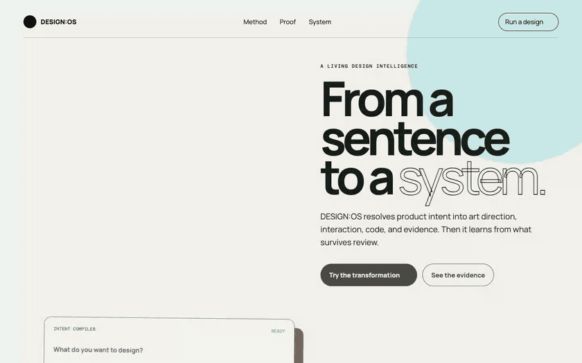</a></td>
    <td><a href="showcase/018-improving-proof-benchmark/runs/nutrition-native-mobile/index.html"></a></td>
    <td><a href="showcase/018-improving-proof-benchmark/runs/architecture-premium-service/index.html">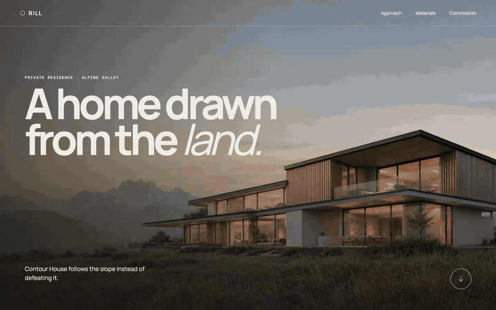</a></td>
  </tr>
</table>

The architecture treatment has since shipped as its own public repo —
[design-os-rill-architecture](https://github.com/jangtrinh/design-os-rill-architecture) —
and leads the showcase grid above. These are runnable treatments, not static mockups: clone
the repo and open them from `showcase/018-improving-proof-benchmark/runs/`, or watch the
recordings — [DESIGN:OS](showcase/018-improving-proof-benchmark/runs/design-os-promotion/demo/design-os-promotion.mp4),
[Nouri](showcase/018-improving-proof-benchmark/runs/nutrition-native-mobile/demo/nutrition-native-mobile.mp4),
[Rill Architecture](showcase/018-improving-proof-benchmark/runs/architecture-premium-service/demo/architecture-demo.mp4) —
and the [rendered critique](showcase/018-improving-proof-benchmark/review-report.md). The
benchmark proves differentiated delivery across product marketing, native-mobile *direction*
(a browser prototype, deliberately not counted as native implementation evidence), and premium
service; it does not claim world-class superiority until matched controls receive blind scores.

### The prompts behind the evidence

The user prompts were intentionally short. DESIGN:OS did not receive a polished creative brief:

```text
Architecture: Build a premium site-specific residential architecture landing page.
Nutrition: Build an AI nutrition experience that helps someone understand a meal.
Planning: Build a planning SaaS landing page for connected decision context.
```

Before implementation, DESIGN:OS compiled each sentence into the generation packet the host model
actually received. The product-specific audience, outcome, and action changed per case; the
orchestration contract below stayed fixed:

```yaml
directions: 3
selectBy: topic fit, evidence strength, execution risk, convergence risk
regions: [hero, proof, context, process-or-connection, conclusion]
eachRegionMustDeclare:
  - purpose and narrative role
  - distinct layout family
  - composition anchor and hierarchy event
  - visual type and rationale
  - responsive transformation
  - craft investment
imagery:
  - plan section-specific image prompts before implementation
  - use purposeful evidence where CSS would become a placeholder
  - keep labels, controls, data, and product state as live HTML
hero:
  - fit message, action, and primary demonstration in the initial desktop viewport
  - show hierarchy, state, and consequence
depth: preserve topic specificity and design investment through the conclusion
composition: test content-led and golden-ratio candidates; release the ratio when content fails
preflight:
  - no placeholder primary visual
  - no generated fake product screenshot
  - no repeated section shell without rationale
  - no quality decline toward the footer
```

Nothing is hidden behind a marketing paraphrase. Read the exact historical packets for
[Architecture](showcase/world-class-benchmark/evidence/repeatability-study/run-packets/d01-orchestrated-r1.json),
[Nutrition](showcase/world-class-benchmark/evidence/repeatability-study/run-packets/d02-orchestrated-r1.json),
and [Planning](showcase/world-class-benchmark/evidence/repeatability-study/run-packets/d03-orchestrated-r1.json).

The current interaction-boundary benchmark deliberately changed two surfaces. Its raw requests
were:

```text
DESIGN:OS: Build a promotional page for DESIGN:OS and push interaction and animation craft.
Nutrition: Build a native mobile nutrition interface, not a responsive website.
Architecture: Build a premium site-specific residential architecture service page.
```

The resulting [benchmark contract](showcase/018-improving-proof-benchmark/benchmark-contract.md)
keeps the web and native claims separate: the Nouri browser prototype communicates native-mobile
direction but does not count as native implementation evidence.

### Why this is our best-performing method

A longer prompt is not the advantage. The advantage is converting vague intent into decisions the
builder and curator can verify:

1. **Product truth before styling.** Audience, outcome, action, and prohibited claims constrain
   what the page must communicate.
2. **Divergence before convergence.** Three structural directions are compared before one visual
   language becomes expensive to change.
3. **Every section has a job.** Region contracts prevent the familiar strong-hero, weak-footer
   quality collapse.
4. **Visual evidence is planned.** Image prompts, aspect ratios, crop behavior, and narrative jobs
   are decided before imagery is generated or sourced.
5. **Product truth stays editable.** Controls, labels, data, and states remain live HTML rather
   than being flattened into a convincing but unusable generated screenshot.
6. **Qualification requires evidence.** Desktop/mobile renders and deterministic gates can reject
   work the model would otherwise describe as finished.

That makes orchestration the best-performing method **in the workflows tested here**, not a claim
that DESIGN:OS is universally best. The same study exposed binary-rule misses and two mobile
overflow failures. Those failures are public because the next product improvement is a
deterministic repair gate, not a stronger adjective.

The nine repeatability runs live in-repo under
`showcase/world-class-benchmark/evidence/repeatability-study/` (clone to open the HTML). Full
evidence: [controlled comparison](showcase/world-class-benchmark/evidence/controlled-three-way-comparison.md),
[repeatability result](showcase/world-class-benchmark/evidence/repeatability-study/result.md),
and [blind curator report](showcase/world-class-benchmark/evidence/repeatability-study/blind-curation/report.md).

</details>

---

## The agent learns in the work

DESIGN:OS now separates four claims that are often blurred together:

1. **ALIVE** — the project has a learning loop.
2. **LEARNING** — evidence became a bounded lesson.
3. **APPLIED** — later work cites and uses that lesson.
4. **IMPROVING** — a preregistered suite of at least three holdouts across at least two
   categories clears the declared mean-quality, aggregate-repair, recurrence, and safety
   thresholds — the deterministic engine computes the suite verdict itself.

The proof is causal rather than volumetric. A thousand memory events do not prove learning. An
APPLIED claim needs the original evidence, a later retrieval/application receipt, the affected
decision, the artifact, and its outcome. Escaped defects need a gate, a failing negative fixture,
and a later run.

The first dogfood study used three real project histories:

| Project | Supported level | What it proves |
|---|---|---|
| ease-design | **APPLIED** | User feedback changed orchestration and a later Nutrition Planning delivery |
| client-portal (confidential) | **LEARNING** | Persistent project identity and harvested project lessons |
| platform-design-system | **APPLIED** | Escaped defects became executable gates with negative fixtures and later detections |

The controlled Nutrition Planning run compared a
[memory-disabled control](showcase/017-living-agent-proof/benchmark/control/index.html) at 89/100
against a [learning-enabled treatment](showcase/017-living-agent-proof/benchmark/treatment/index.html)
at 94/100. Static comparison images are intentionally omitted from this README.

The treatment eliminated prohibited text/Unicode interface glyphs **27 → 0**, added motivated
scroll reveals, preserved reduced-motion handling, and won the independent blind review by five
points. After the first blind findings were reapplied, it improved **89 → 94** without the user
repeating the feedback.

The deterministic verdict is still **APPLIED**, not **IMPROVING**. The study did not clear the
predeclared +10 comparison delta, used one treatment repair round, and has not completed
contradiction or cross-project isolation runs. That boundary is intentional: the final design
crossed the world-class visual threshold, but one successful case is not proof of an everyday
trend — the engine now enforces a suite-level gate, so no single comparison can graduate on
its own.

Run the evidence report:

```bash
design-os evolution \
  --dir . \
  --proof showcase/017-living-agent-proof/evidence/ease-design-proof.json
```

Read the [controlled result](showcase/017-living-agent-proof/benchmark/result.md),
[forensic project comparison](showcase/017-living-agent-proof/evidence/forensic-report.md), and
[machine-readable proof](showcase/017-living-agent-proof/evidence/ease-design-proof.json).

---

## Built by the studio behind DESIGN:OS

Five live products, five different worlds — an AI dev-tool, a farm's direct-to-Hanoi
fruit brand, a plugin marketplace, a villa-care service, a deal CRM for real-estate
brokers. Same studio, same design discipline this toolchain distills. **Real scrolling
recordings of the live sites — every demo links through.**

<table>
  <tr>
    <td width="50%"><a href="https://easeui.design/">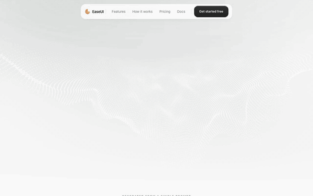</a></td>
    <td width="50%"><a href="https://www.traicaybentre.com/"></a></td>
  </tr>
  <tr>
    <td><b>EaseUI</b> · <a href="https://easeui.design/">easeui.design</a><br/><sub>AI UI generation · SaaS landing</sub></td>
    <td><b>Trái Cây Bến Tre</b> · <a href="https://www.traicaybentre.com/">traicaybentre.com</a><br/><sub>D2C farm brand · editorial e-commerce</sub></td>
  </tr>
  <tr>
    <td><a href="https://www.gravityhive.com/"></a></td>
    <td><a href="https://www.hvs.care/">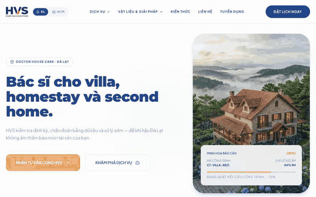</a></td>
  </tr>
  <tr>
    <td><b>GravityHive</b> · <a href="https://www.gravityhive.com/">gravityhive.com</a><br/><sub>plugin marketplace · brutalist type</sub></td>
    <td><b>HVS</b> · <a href="https://www.hvs.care/">hvs.care</a><br/><sub>villa & homestay care · bilingual services</sub></td>
  </tr>
  <tr>
    <td colspan="2" align="center"><a href="https://www.sodeal.vn/">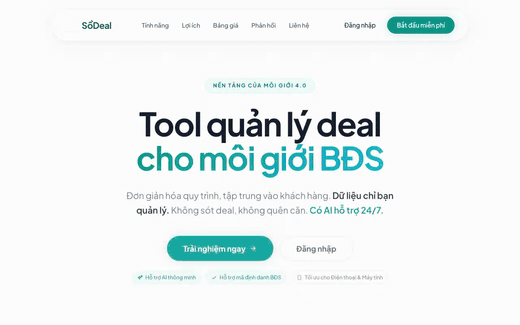</a></td>
  </tr>
  <tr>
    <td colspan="2" align="center"><b>SổDeal</b> · <a href="https://www.sodeal.vn/">sodeal.vn</a><br/><sub>deal CRM for real-estate brokers · SaaS</sub></td>
  </tr>
</table>

Under the hood the same mechanism scales from one screen to a whole product: 26 personas
compile the same 27-component, paired-token starter kit into any system (`ui ds init`), and every
qualified surface must provide evidence for the declared machine gates before it ships. The toolchain is also
dogfooded on a production internal developer platform — a 129-component Figma library
scanned, hygiene-audited, contrast-proven, and VR-baselined end to end.

---

## Six daily verbs

These are the six common moves. The full adapter exposes 18 workflows (plus the internal critique gate) when the task needs more.

| Verb | What it does |
| --- | --- |
| `/ui:generate <intent>` | Weak intent compiled into a typed brief and generation contract; one candidate is rendered, repaired, and delivered by qualification status. |
| `/ui:learn` | Brownfield onboarding — compile the DS from **your project's own evidence** (code, a URL, or Figma) instead of a persona default. |
| `/ui:iterate` · `/ui:refine` | Tweak in plain words; surgical line-diffs, re-scored; the DS hash-seal stays intact. |
| `/ui:from-url <url>` | Extract a live site's design system into a portable folder (spec + tokens + audit). |
| `/ui:to-figma <intent>` | Author **idiomatic Figma** on the canvas — auto-layout, real instances, token-bound variables. |
| `/ui:why <question>` | Ask *why* a past design decision was made — answers with provenance from the project's design memory. |

<details>
<summary><b>All 18 workflows (+1 internal gate)</b> (audit · chart · critique · design · diagram · evidence · extract · figma · from-ref · slides · redesign …)</summary>

| Command | What it does |
|---|---|
| `/ui:generate <intent>` | Start a fresh design from a plain-language description. Token-bound variants across diverse personas. |
| `/ui:iterate <change>`  | Tweak the current design in plain words; applied as a surgical line-diff, re-scored by the gate. |
| `/ui:refine`            | Run the full critique→refine polish loop on the current design. |
| `/ui:redesign <intent>` | Reimagine an existing page in a different persona/direction. |
| `/ui:from-url <url>`    | Extract a live site's design system into a self-contained `./<slug>/` folder (spec + tokens + audit). |
| `/ui:from-ref <path>`   | Generate from a reference (image/markup), matching its look on your design system. |
| `/ui:figma`             | Reproduce a Figma source 1:1 as HTML (keeps source colors intentionally). |
| `/ui:to-figma <intent>` | Author idiomatic Figma on the canvas from intent — needs the figma-agent hand. |
| `/ui:extract`           | Pull a design system **out of** existing HTML. |
| `/ui:slides <intent>`   | Generate a token-bound slide deck. |
| `/ui:learn`             | Compile the DS from the project's own evidence (code, URL, or Figma). |
| `/ui:design <brief>`    | The AI-designer flow — scope-aware facet planning + curator scoring on a full brief. |
| `/ui:diagram <intent>`  | Author an accessible offline diagram as inspectable SVG across 19 grammars; product-flow views preserve source IDs and disclose every fidelity trade-off. |
| `/ui:chart <intent>`    | Author a standalone chart of quantities across 9 grammars — zero baselines, declared truncation, no fabricated data. |
| `/ui:audit <target>`    | Run the deterministic audit families against a produced design. |
| `/ui:evidence`          | Intake user evidence (interviews, tickets, analytics) into the anti-fabrication ledger. |
| `/ui:why <question>`    | Trace picks, edits, verdicts, and token changes from the design memory, with provenance. |
| *(internal)* `/ui:critique` | The gate — runs inside every HTML-emitting flow. |

</details>

### Native diagrams and charts without a DSL

`/ui:diagram` covers **19 grammars** — architecture, sequence, product-flow, swimlane,
data-flow, process, ER, state, flowchart, tree, org-chart, layers, nested, loop, and the
platform family. `/ui:chart` is a sibling capability covering **9** — bar, line, scatter,
radar, gantt, timeline, quadrant, venn, pyramid.

Each invocation produces **one self-contained HTML file** with hand-authored inline SVG.
No Mermaid, no PlantUML, no charting library, no headless browser, no network request at
view time. Colours resolve to your project's design tokens and fall back to a documented
neutral palette when there is no design system yet.

**See all 28 →** [design:os example gallery](https://jangtrinh.github.io/design-os/examples/)

<!-- BEGIN:examples-grid (generated by scripts/build-examples-gallery.mjs) -->

<table>
<tr>
<td width="50%"><a href="https://jangtrinh.github.io/design-os/examples/diagrams/architecture.html" title="Three-tier web application — open the live artifact"><picture><source media="(prefers-color-scheme: dark)" srcset="docs/images/examples/diagrams/architecture-dark.png">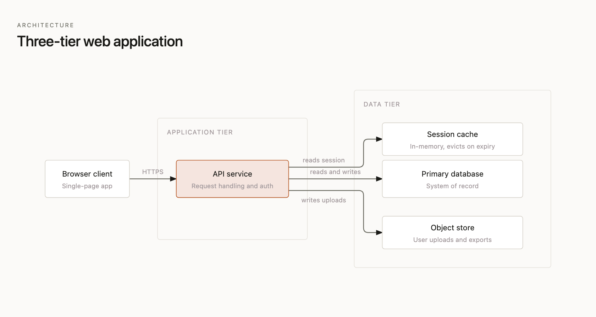</picture></a><br><sub><b>architecture</b> — Three-tier web application</sub></td>
<td width="50%"><a href="https://jangtrinh.github.io/design-os/examples/diagrams/medallion.html" title="Survey dataset storage tiers — open the live artifact"><picture><source media="(prefers-color-scheme: dark)" srcset="docs/images/examples/diagrams/medallion-dark.png">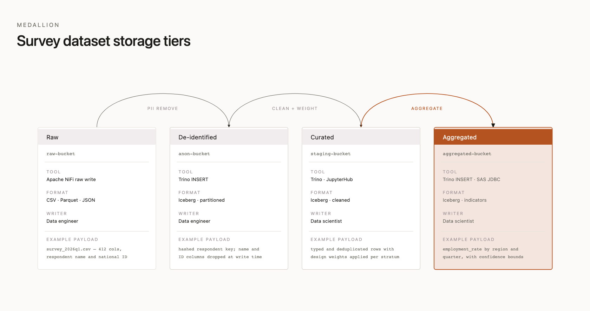</picture></a><br><sub><b>medallion</b> — Survey dataset storage tiers</sub></td>
</tr>
<tr>
<td width="50%"><a href="https://jangtrinh.github.io/design-os/examples/charts/bar.html" title="Revenue by region, FY2025 — open the live artifact"><picture><source media="(prefers-color-scheme: dark)" srcset="docs/images/examples/charts/bar-dark.png">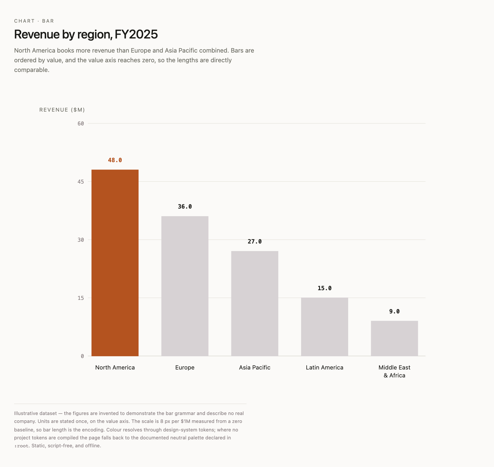</picture></a><br><sub><b>bar</b> — Revenue by region, FY2025</sub></td>
<td width="50%"><a href="https://jangtrinh.github.io/design-os/examples/charts/quadrant.html" title="Q3 initiatives by effort and impact — open the live artifact"><picture><source media="(prefers-color-scheme: dark)" srcset="docs/images/examples/charts/quadrant-dark.png">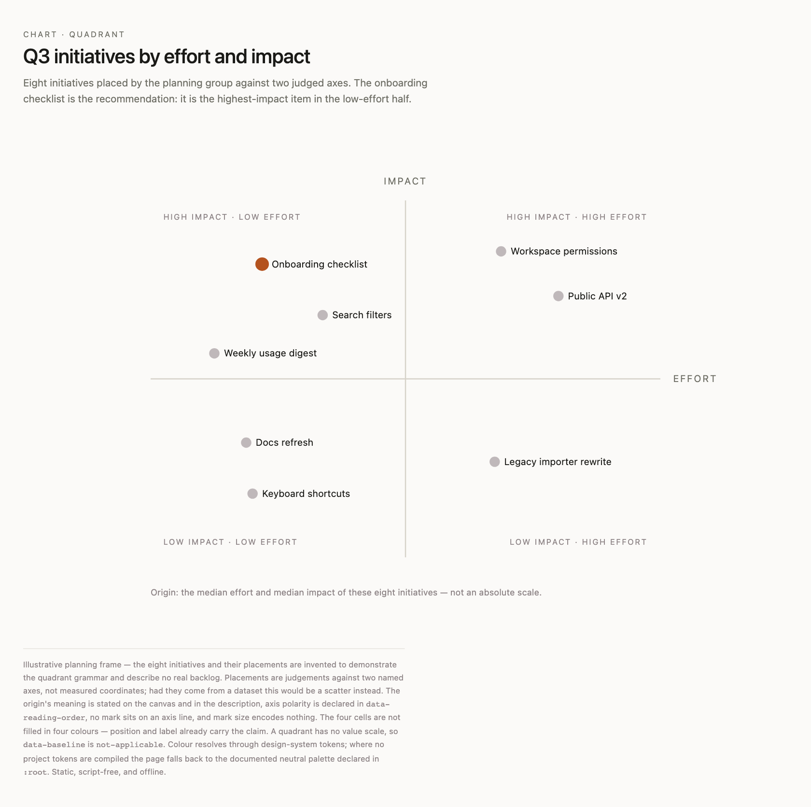</picture></a><br><sub><b>quadrant</b> — Q3 initiatives by effort and impact</sub></td>
</tr>
</table>

<details>
<summary><b>All 28 grammars rendered</b> — every one of these is a committed artifact that passes its linter with zero findings</summary>

<table>
<tr>
<td width="33%"><a href="https://jangtrinh.github.io/design-os/examples/diagrams/data-flow.html" title="Nightly reporting run — open the live artifact"><picture><source media="(prefers-color-scheme: dark)" srcset="docs/images/examples/diagrams/data-flow-dark.png">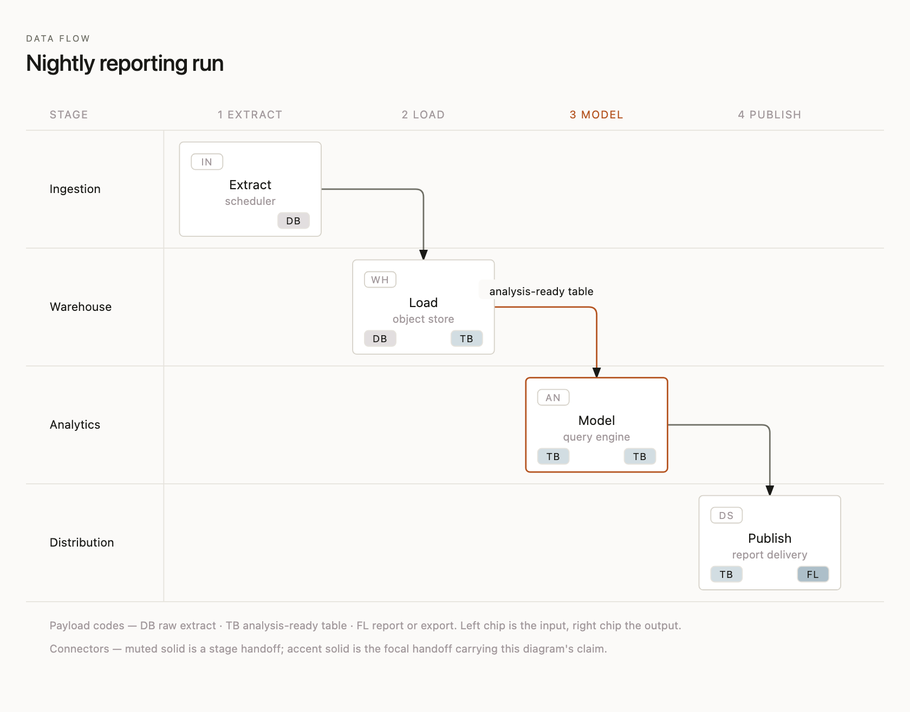</picture></a><br><sub><b>data-flow</b></sub></td>
<td width="33%"><a href="https://jangtrinh.github.io/design-os/examples/diagrams/dp-integration.html" title="Data platform integration surfaces — open the live artifact"><picture><source media="(prefers-color-scheme: dark)" srcset="docs/images/examples/diagrams/dp-integration-dark.png">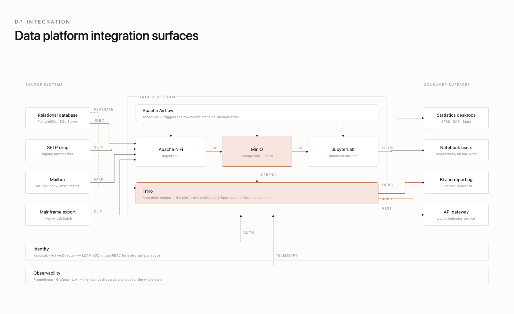</picture></a><br><sub><b>dp-integration</b></sub></td>
<td width="33%"><a href="https://jangtrinh.github.io/design-os/examples/diagrams/dp-security-matrix.html" title="Platform entitlement matrix — open the live artifact"><picture><source media="(prefers-color-scheme: dark)" srcset="docs/images/examples/diagrams/dp-security-matrix-dark.png">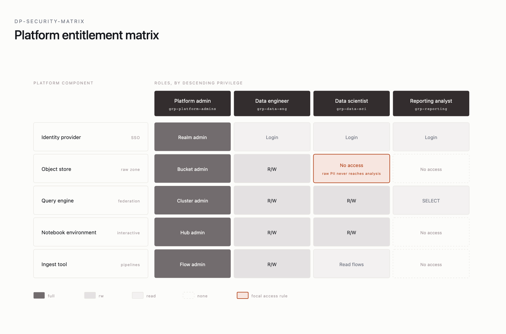</picture></a><br><sub><b>dp-security-matrix</b></sub></td>
</tr>
<tr>
<td width="33%"><a href="https://jangtrinh.github.io/design-os/examples/diagrams/er.html" title="Order model — open the live artifact"><picture><source media="(prefers-color-scheme: dark)" srcset="docs/images/examples/diagrams/er-dark.png">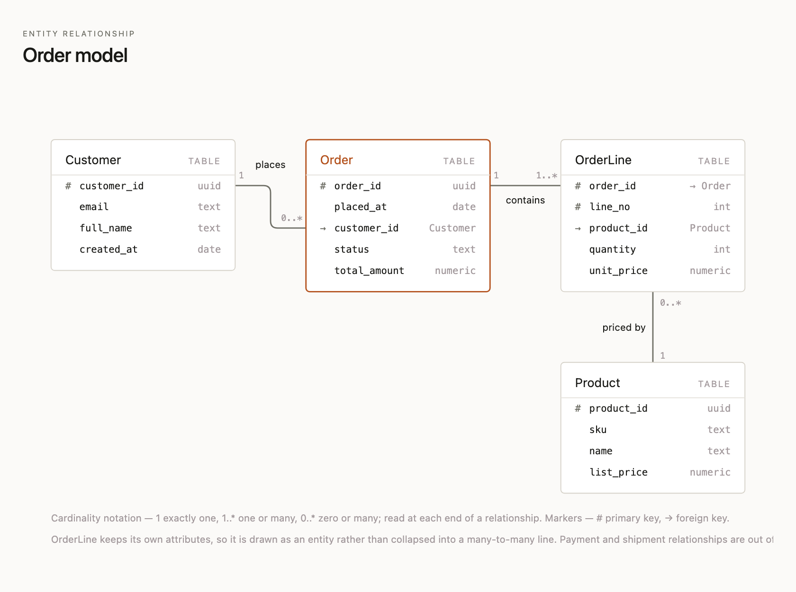</picture></a><br><sub><b>er</b></sub></td>
<td width="33%"><a href="https://jangtrinh.github.io/design-os/examples/diagrams/flowchart.html" title="Loan eligibility check — open the live artifact"><picture><source media="(prefers-color-scheme: dark)" srcset="docs/images/examples/diagrams/flowchart-dark.png">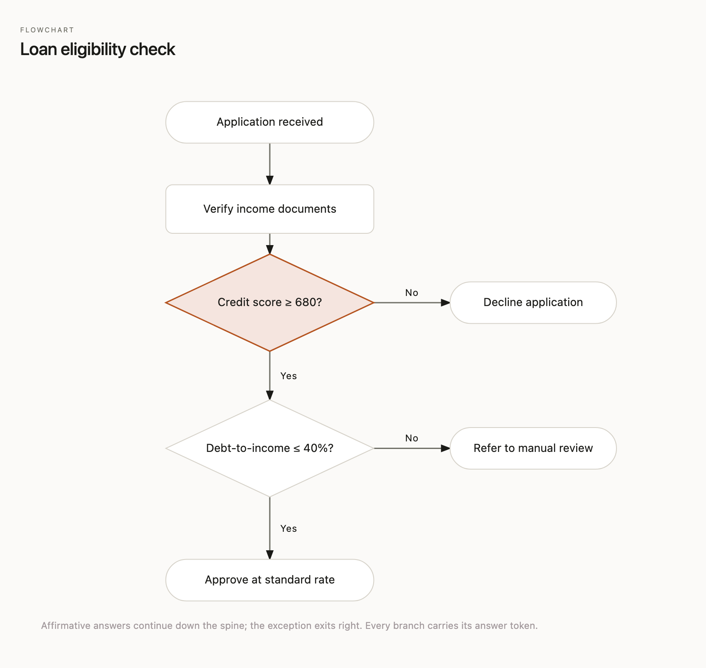</picture></a><br><sub><b>flowchart</b></sub></td>
<td width="33%"><a href="https://jangtrinh.github.io/design-os/examples/diagrams/high-level.html" title="Lakehouse capability sweep — open the live artifact"><picture><source media="(prefers-color-scheme: dark)" srcset="docs/images/examples/diagrams/high-level-dark.png">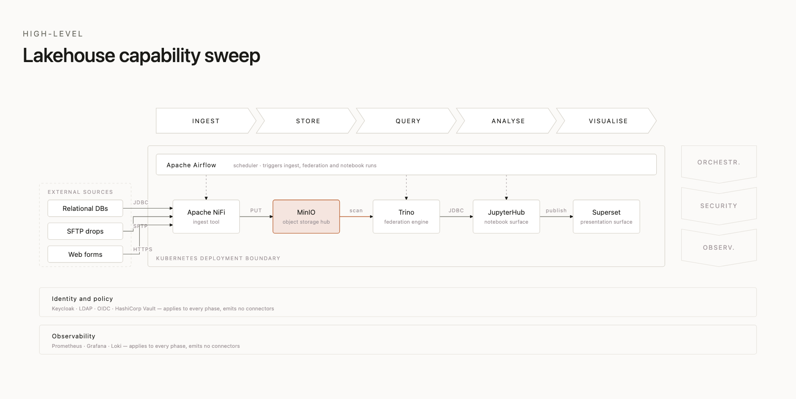</picture></a><br><sub><b>high-level</b></sub></td>
</tr>
<tr>
<td width="33%"><a href="https://jangtrinh.github.io/design-os/examples/diagrams/it-state.html" title="Statistics estate before modernisation — open the live artifact"><picture><source media="(prefers-color-scheme: dark)" srcset="docs/images/examples/diagrams/it-state-dark.png">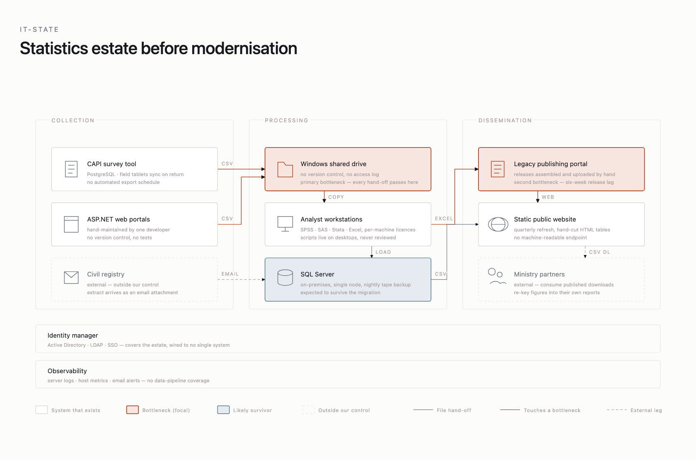</picture></a><br><sub><b>it-state</b></sub></td>
<td width="33%"><a href="https://jangtrinh.github.io/design-os/examples/diagrams/layers.html" title="Runtime stack, hardware upward — open the live artifact"><picture><source media="(prefers-color-scheme: dark)" srcset="docs/images/examples/diagrams/layers-dark.png">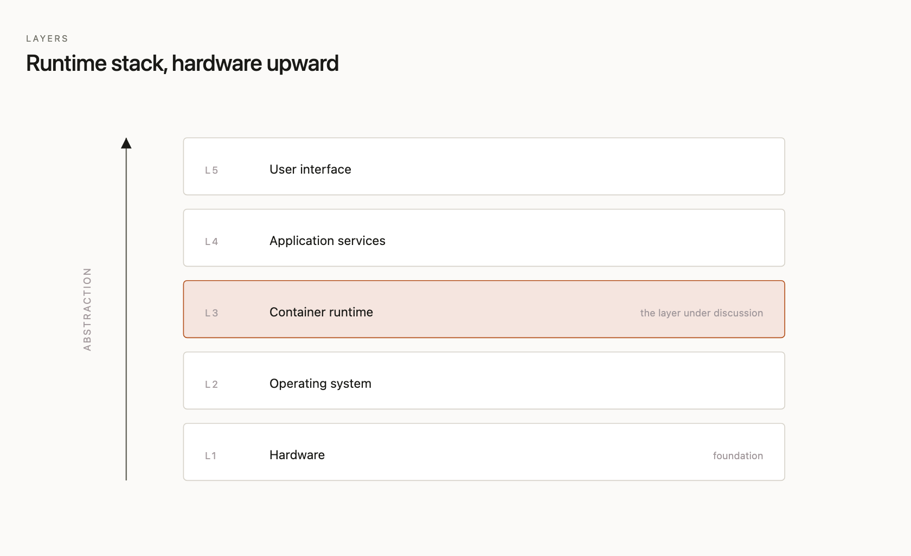</picture></a><br><sub><b>layers</b></sub></td>
<td width="33%"><a href="https://jangtrinh.github.io/design-os/examples/diagrams/loop.html" title="Platform operating cycle — open the live artifact"><picture><source media="(prefers-color-scheme: dark)" srcset="docs/images/examples/diagrams/loop-dark.png">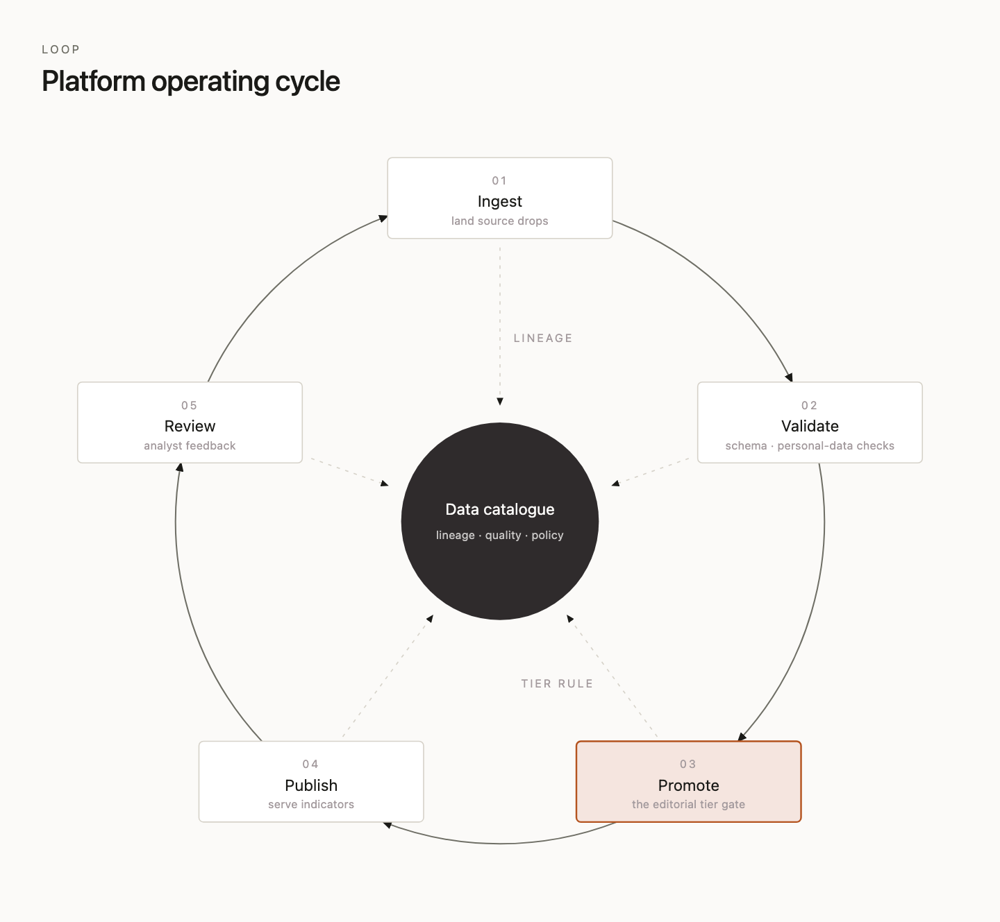</picture></a><br><sub><b>loop</b></sub></td>
</tr>
<tr>
<td width="33%"><a href="https://jangtrinh.github.io/design-os/examples/diagrams/nested.html" title="Trust zones, outside in — open the live artifact"><picture><source media="(prefers-color-scheme: dark)" srcset="docs/images/examples/diagrams/nested-dark.png">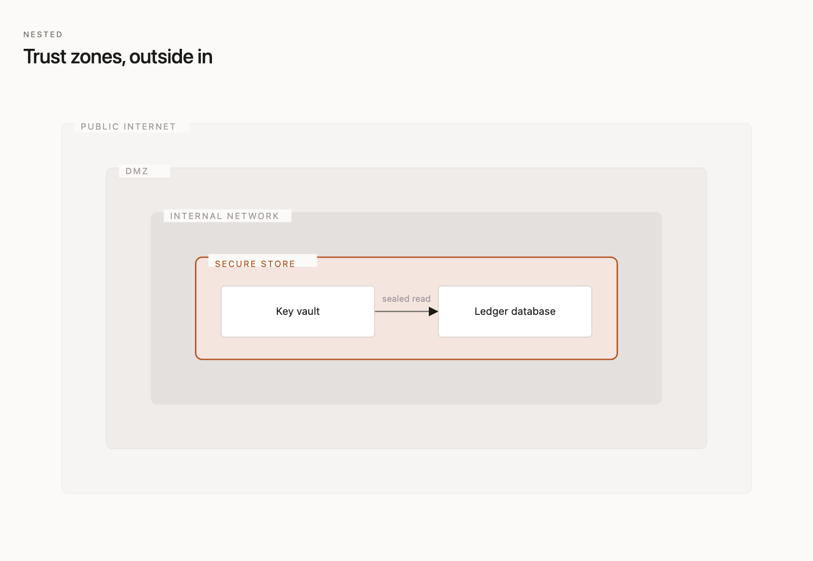</picture></a><br><sub><b>nested</b></sub></td>
<td width="33%"><a href="https://jangtrinh.github.io/design-os/examples/diagrams/org-chart.html" title="Engineering, who to reach — open the live artifact"><picture><source media="(prefers-color-scheme: dark)" srcset="docs/images/examples/diagrams/org-chart-dark.png">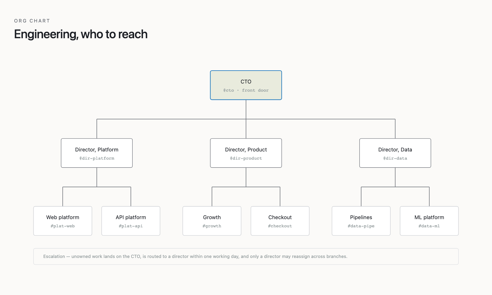</picture></a><br><sub><b>org-chart</b></sub></td>
<td width="33%"><a href="https://jangtrinh.github.io/design-os/examples/diagrams/process.html" title="Incident response runbook — open the live artifact"><picture><source media="(prefers-color-scheme: dark)" srcset="docs/images/examples/diagrams/process-dark.png">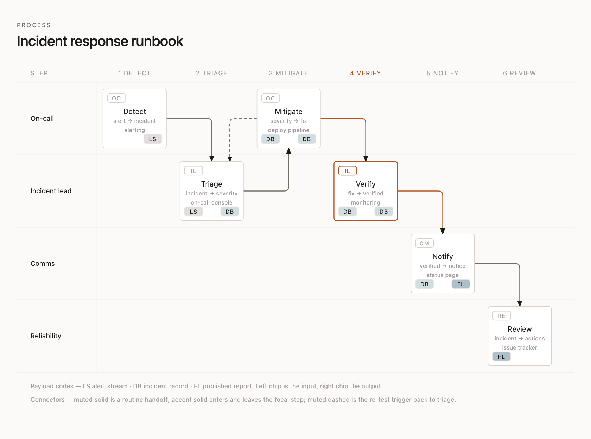</picture></a><br><sub><b>process</b></sub></td>
</tr>
<tr>
<td width="33%"><a href="https://jangtrinh.github.io/design-os/examples/diagrams/product-flow.html" title="Checkout flow, partial view — open the live artifact"><picture><source media="(prefers-color-scheme: dark)" srcset="docs/images/examples/diagrams/product-flow-dark.png">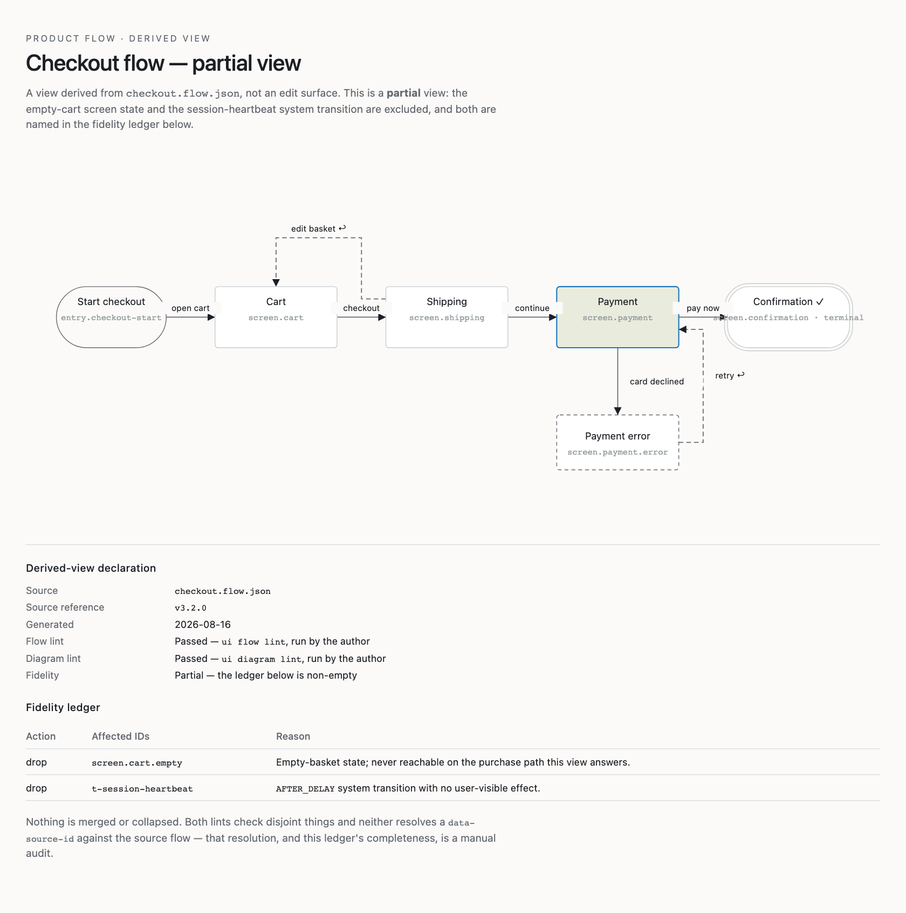</picture></a><br><sub><b>product-flow</b></sub></td>
<td width="33%"><a href="https://jangtrinh.github.io/design-os/examples/diagrams/sequence.html" title="User sign-in exchange — open the live artifact"><picture><source media="(prefers-color-scheme: dark)" srcset="docs/images/examples/diagrams/sequence-dark.png">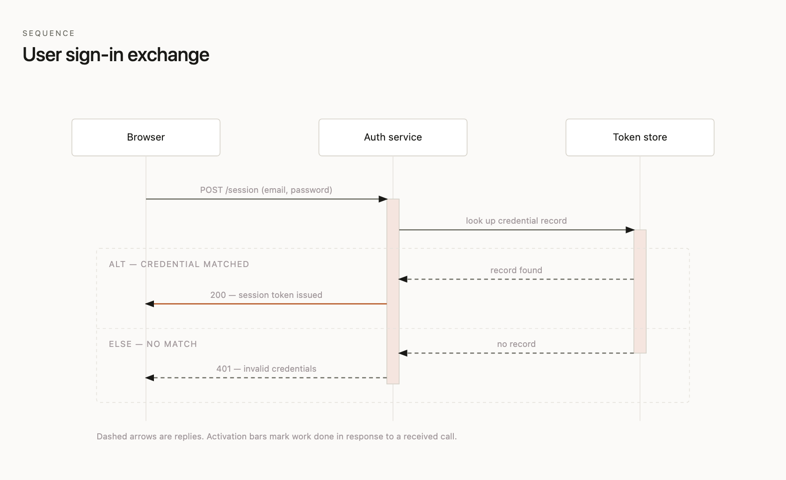</picture></a><br><sub><b>sequence</b></sub></td>
<td width="33%"><a href="https://jangtrinh.github.io/design-os/examples/diagrams/state.html" title="Subscription lifecycle — open the live artifact"><picture><source media="(prefers-color-scheme: dark)" srcset="docs/images/examples/diagrams/state-dark.png">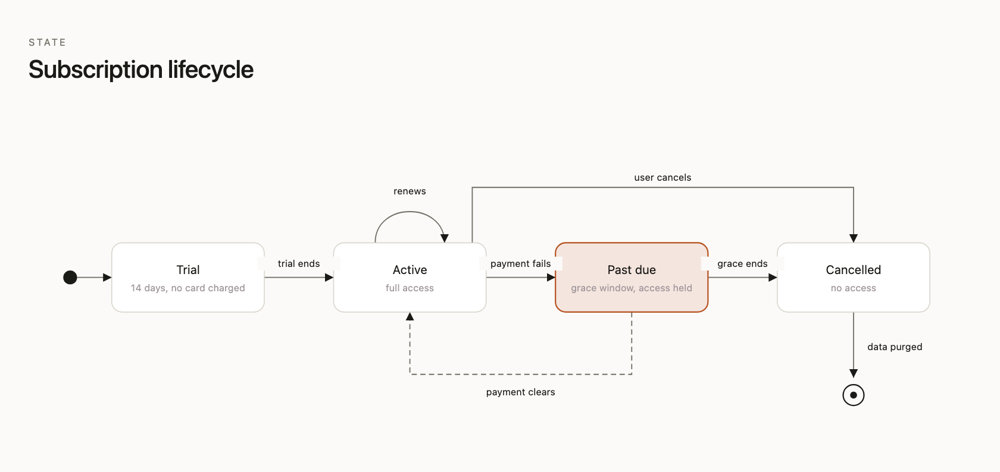</picture></a><br><sub><b>state</b></sub></td>
</tr>
<tr>
<td width="33%"><a href="https://jangtrinh.github.io/design-os/examples/diagrams/swimlane.html" title="Expense claim ownership — open the live artifact"><picture><source media="(prefers-color-scheme: dark)" srcset="docs/images/examples/diagrams/swimlane-dark.png">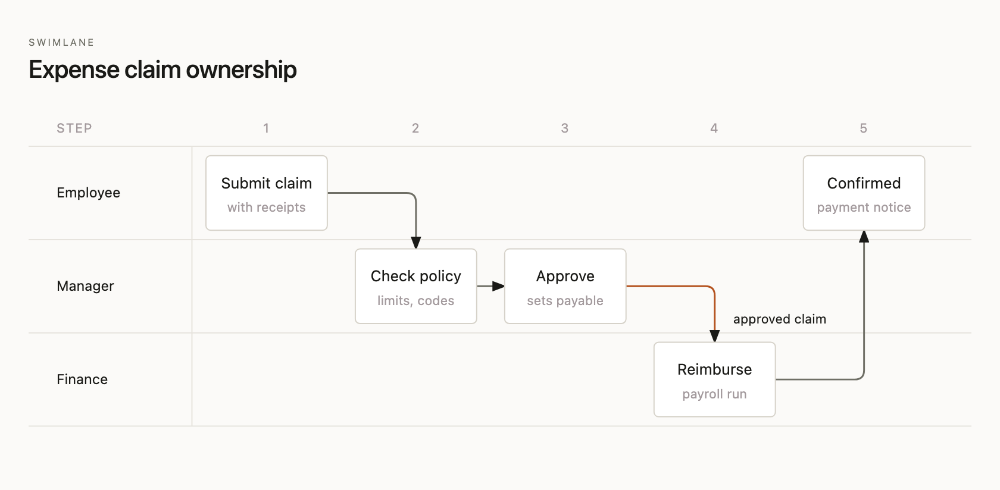</picture></a><br><sub><b>swimlane</b></sub></td>
<td width="33%"><a href="https://jangtrinh.github.io/design-os/examples/diagrams/tree.html" title="Catalogue taxonomy, root at the leading edge — open the live artifact"><picture><source media="(prefers-color-scheme: dark)" srcset="docs/images/examples/diagrams/tree-dark.png">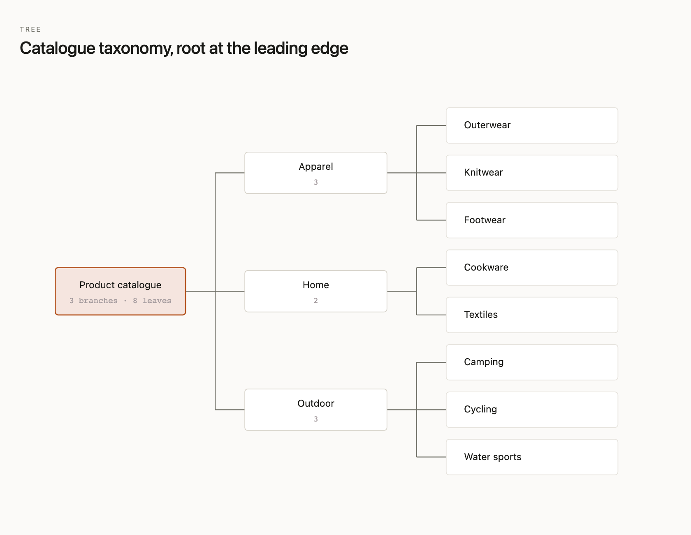</picture></a><br><sub><b>tree</b></sub></td>
<td width="33%"><a href="https://jangtrinh.github.io/design-os/examples/charts/gantt.html" title="Reporting platform plan, H1 2026 — open the live artifact"><picture><source media="(prefers-color-scheme: dark)" srcset="docs/images/examples/charts/gantt-dark.png">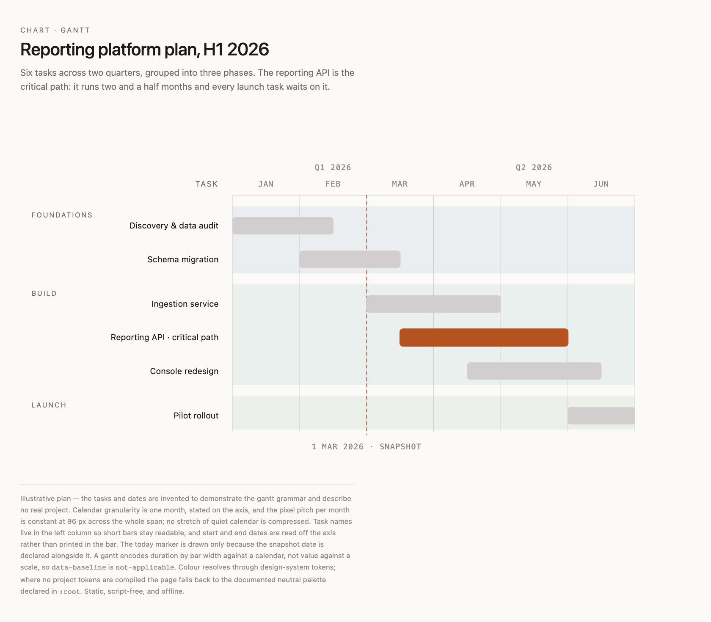</picture></a><br><sub><b>gantt</b></sub></td>
</tr>
<tr>
<td width="33%"><a href="https://jangtrinh.github.io/design-os/examples/charts/line.html" title="Monthly active users, 2025 — open the live artifact"><picture><source media="(prefers-color-scheme: dark)" srcset="docs/images/examples/charts/line-dark.png">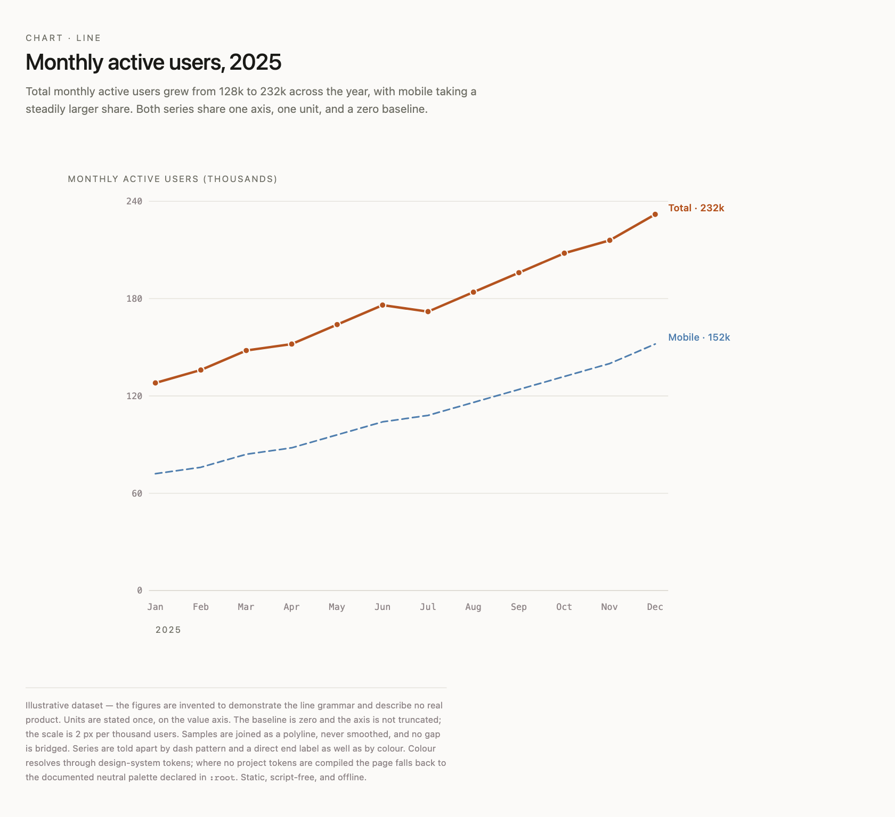</picture></a><br><sub><b>line</b></sub></td>
<td width="33%"><a href="https://jangtrinh.github.io/design-os/examples/charts/pyramid.html" title="Self-serve conversion funnel, Q2 — open the live artifact"><picture><source media="(prefers-color-scheme: dark)" srcset="docs/images/examples/charts/pyramid-dark.png">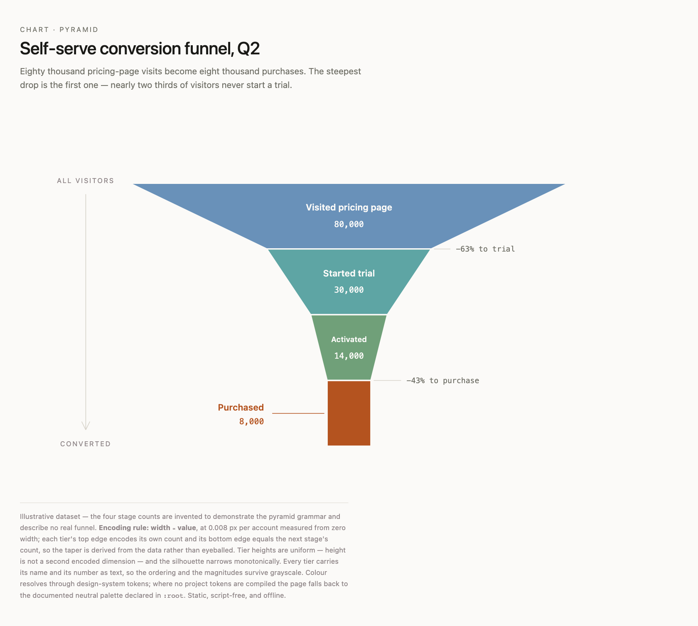</picture></a><br><sub><b>pyramid</b></sub></td>
<td width="33%"><a href="https://jangtrinh.github.io/design-os/examples/charts/radar.html" title="Streaming engine capability profiles — open the live artifact"><picture><source media="(prefers-color-scheme: dark)" srcset="docs/images/examples/charts/radar-dark.png">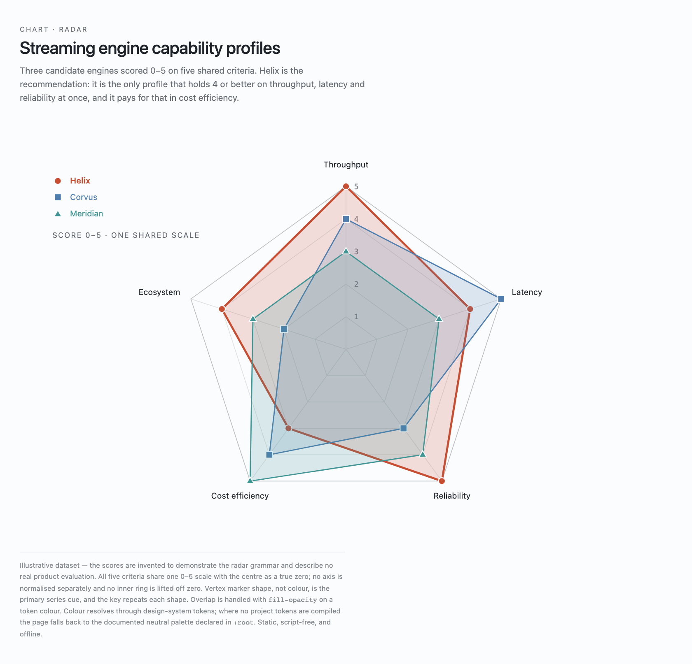</picture></a><br><sub><b>radar</b></sub></td>
</tr>
<tr>
<td width="33%"><a href="https://jangtrinh.github.io/design-os/examples/charts/scatter.html" title="Response time against request size — open the live artifact"><picture><source media="(prefers-color-scheme: dark)" srcset="docs/images/examples/charts/scatter-dark.png">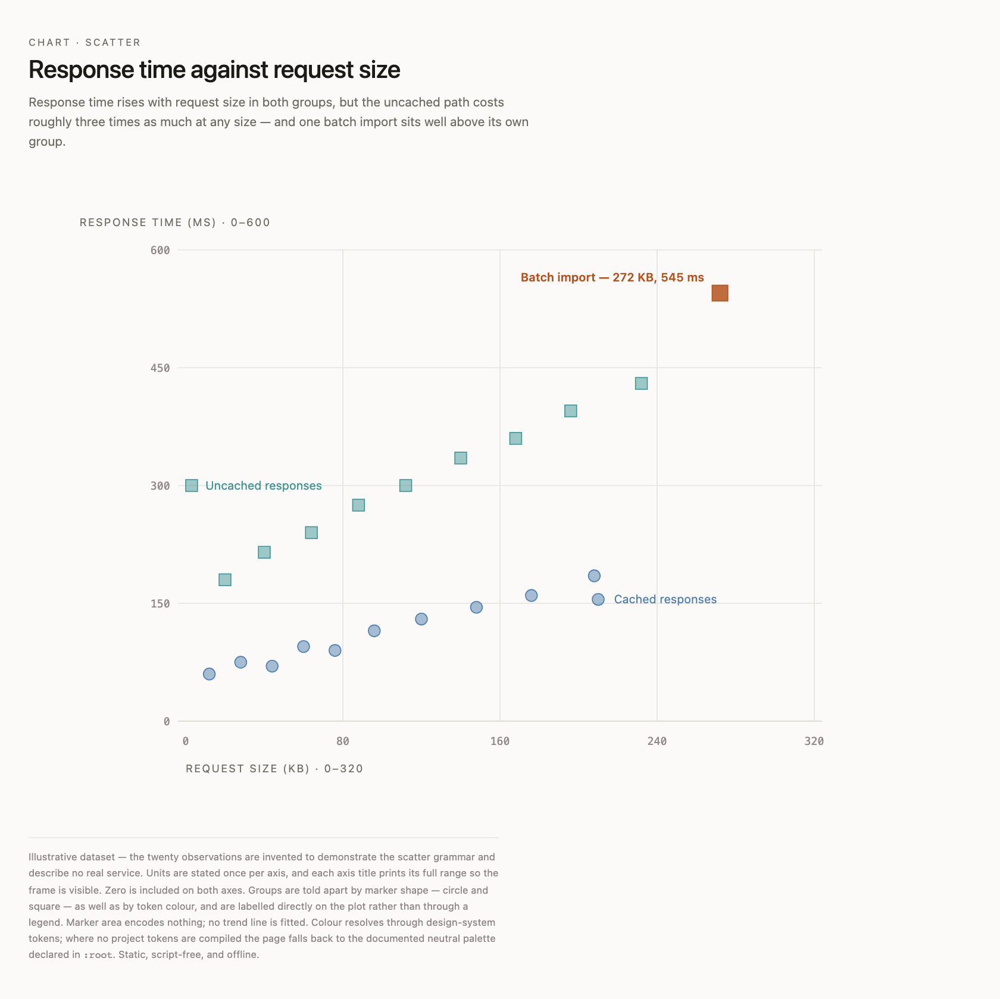</picture></a><br><sub><b>scatter</b></sub></td>
<td width="33%"><a href="https://jangtrinh.github.io/design-os/examples/charts/timeline.html" title="Release history, 2025 — open the live artifact"><picture><source media="(prefers-color-scheme: dark)" srcset="docs/images/examples/charts/timeline-dark.png">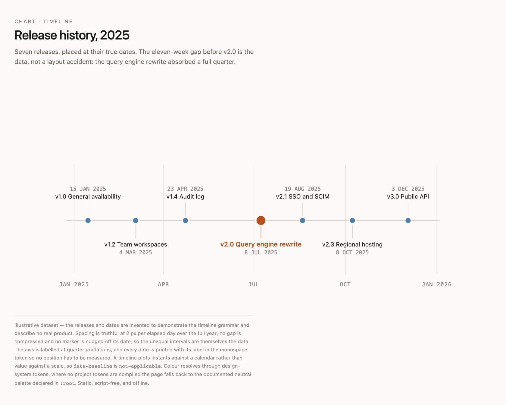</picture></a><br><sub><b>timeline</b></sub></td>
<td width="33%"><a href="https://jangtrinh.github.io/design-os/examples/charts/venn.html" title="Overlap between three workspace roles — open the live artifact"><picture><source media="(prefers-color-scheme: dark)" srcset="docs/images/examples/charts/venn-dark.png">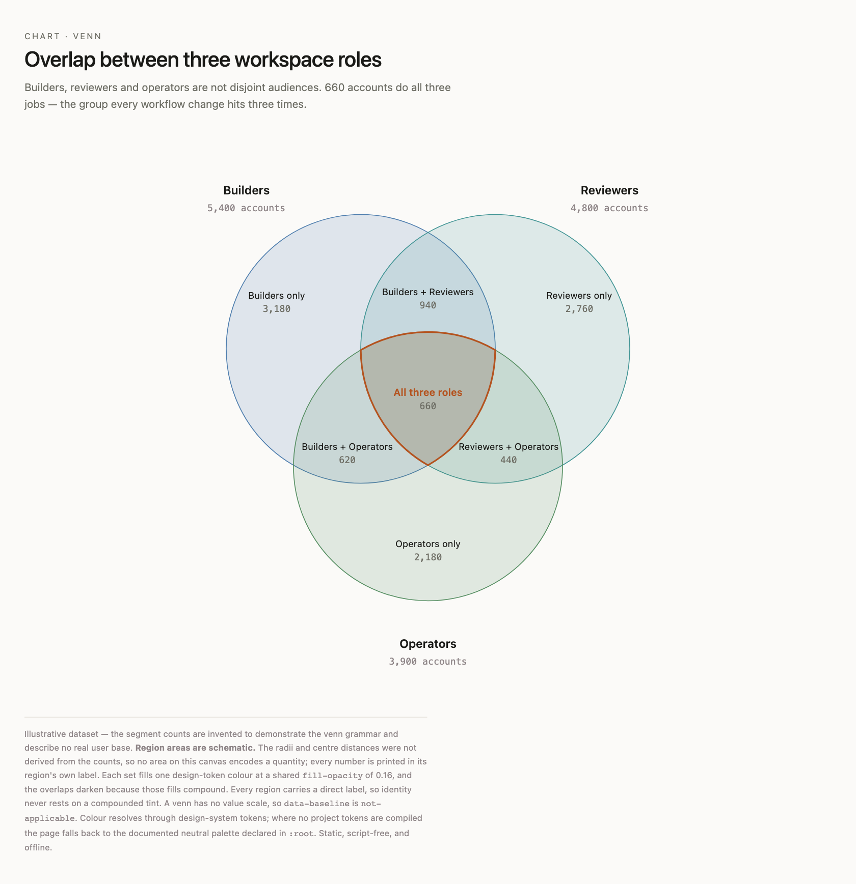</picture></a><br><sub><b>venn</b></sub></td>
</tr>
</table>

</details>

<!-- END:examples-grid -->

#### What the gate actually proves

`ui diagram lint` and `ui chart lint` are deterministic, and deliberately narrow — they
check the facts a static reader can prove, never whether the picture is any good:

| Check | Catches |
| --- | --- |
| `hardcoded-svg-color` | A colour in an SVG presentation attribute. `ds-usage-lint` reads CSS declarations only, so `fill="#eb6c36"` would otherwise bypass the design system while showing green. |
| `diagonal-line` | A connector running off-axis in a grammar whose layout reads by alignment. Grammar-gated — radial and hierarchical shapes are exempt by construction, not by exception. |
| `svg-labelledby` · `no-script` · `no-external-ref` | An artifact that is unreadable to a screen reader, or that reaches outside itself. |
| `zero-baseline-required` · `baseline-declared` | A bar or pyramid whose length encoding starts anywhere but zero, and any chart that lets a reader *assume* zero without saying so. |
| `series-label` · `no-dual-axis` | Series separated by colour alone, and two scales overlaid on one frame. |

A clean lint means the contract holds. Whether the diagram is *right* is the taste rubric's
job, and it runs afterwards at the same ≥ 7/10 gate every other surface meets.

#### Routing across 28 grammars stays decidable

Nineteen diagram grammars include deliberate near-neighbours — a swimlane, a data-flow, and
a process diagram are the same grid at three levels of detail. Three mechanisms keep
selection from collapsing into a coin flip: trigger tokens are **pairwise disjoint across
both capabilities**, `diagram-craft.md` states **precedence once per collision family**, and
a **golden corpus of briefs** asserts each resolves to exactly one grammar. The third is the
only one that tests behaviour rather than shape.

Diagrams can also be **redrawn from an existing source**: the drawio and Mermaid extractors
emit a node/edge digest that a grammar is authored *from*, never converted into. Imported
geometry never reaches the artifact, and the redraw carries a ledger of what it simplified.

---

## Quick start

```sh
npm install -g ease-design     # installs the `ui` kernel (zero runtime deps)
ui doctor                      # verify the install is healthy
```

Wire it into the project you want to design for:

```sh
cd ~/code/your-app
ui init --runtime claude       # or: --runtime codex | --runtime antigravity
```

Then open your agent CLI in that project and type:

```
/ui:generate a pricing page for a developer-tools SaaS — 3 tiers, dark theme
```

That's the whole loop: **describe → compile → qualify.** Have an existing app? Run
`/ui:learn` first so the DS is compiled from your product's own evidence.

`ease-design` is DESIGN:OS's npm name — the package ships the `ui` kernel. `v0.3.0`
(published from CI with sigstore provenance) carries all 42 commands, including the tenant
scroll engine and the asset gates behind the showcase grid.

### Full studio (clone)

```sh
git clone https://github.com/jangtrinh/design-os.git && cd design-os && ./setup.sh
```

One idempotent script builds and links the whole studio, not just the kernel: semantic
recall, the living-agent evolution/heartbeat/harvest loop, rendered accessibility audits,
and the tenant + gflow scroll-cinema toolchain — repo-only hands the npm kernel doesn't
ship. The Figma plugin (and its 1:1 mirror) installs from
[its own repo](https://github.com/jangtrinh/design-os-figma-plugin). Needs
**Node ≥ 22** (the recall hand) and [`uv`](https://docs.astral.sh/uv/) for the `design-os`
umbrella; `./setup.sh --check` verifies prerequisites without changing anything.

One hand is **opt-in, never silent**: `gflow` (Google Flow — the scroll-cinema asset
generator). An interactive run explains what it is, that it needs a paid AI Ultra/Pro
subscription, and that it automates a real browser session on *your* Google account — then
asks. A non-interactive run skips it. `--with-gflow` / `--no-gflow` answer ahead of time.
Skipping costs nothing but the ability to generate *new* footage, and `design-os doctor`
reports the gap up front instead of failing mid-generation.

| Get it | How | What you get | Update |
|---|---|---|---|
| **Kernel** | `npm i -g ease-design` | the 42-command `ui` binary + `/ui:*` adapters — generate, gates, tokens, DS, tenant scroll engine | `npm i -g ease-design@latest` |
| **Full studio** | `git clone` + `./setup.sh` | everything above at HEAD + recall, rendered a11y, heartbeat/evolution, and the opt-in gflow browser hand | `git pull` + `design-os update` |
| **Figma plugin** | [design-os-figma-plugin](https://github.com/jangtrinh/design-os-figma-plugin) | the plugin + `figma-agent` CLI + the 1:1 mirror — versioned in its own repo | its own repo's releases |

The `ui` kernel never phones home — it is deterministic and network-free by design, so it
will not nag about new versions; updating is always your move, with the one-liner above.

---

## Qualified Delivery

A better prompt improves the first draft. It does not prove the draft is ready.
`/ui:generate` now treats generation as a typed, evidence-bearing release process:

```text
raw request
  → design-brief.json
  → generation-contract.json
  → candidate + 1440/768/390 renders
  → qualification-record.json
  → QUALIFIED | DRAFT_WITH_CONCERNS | BLOCKED_BY_EVIDENCE
```

The host model owns design reasoning. The zero-dependency `ui` kernel only validates
contracts and rejects false-green verdicts:

```sh
ui delivery validate design-brief.json
ui delivery validate generation-contract.json
ui delivery validate qualification-record.json
ui delivery validate learning-record.json
```

`QUALIFIED` is deliberately difficult to emit. It requires:

- all six declared static gates passing;
- rendered evidence at desktop, tablet, and mobile widths;
- every Must acceptance criterion covered;
- zero unsupported claims;
- zero unresolved findings.

The repair loop is capped at three attempts. Missing rendered evidence never silently
passes; the result remains `DRAFT_WITH_CONCERNS`. Automated checks narrow known failure
classes—they do not claim WCAG conformance, desirability, or business performance.

Qualified Delivery v2 adds an implementation-grade craft contract:

- Phosphor icons by default for greenfield UI, with evidenced brownfield exceptions;
- third-party logos resolved from SVGL and cached with provenance;
- purpose-fit original imagery through Codex image generation backed by GPT Image 2;
- intentional `390` / `768` / `1440` responsive transformations;
- hero, scroll, loading, interaction, reduced-motion, and JavaScript-failure evidence;
- custom-styled semantic controls with keyboard and pointer proof for custom behavior;
- a named composition thesis, signature spatial move, and whitespace strategy.

Version 1 artifacts remain valid historical records. Only version 2 proves the current craft
contract. `ui delivery validate` resolves a v2 qualification record's `contractRef` relative to
the record and rejects missing or contradictory evidence.

The design prompt orchestrator compiles weak intent before generation: provenance-bound facets,
product truth, three structurally divergent directions, complete region briefs, actionable visual
DNA, and controlled content-led versus golden-ratio candidates. `ui prompt-plan validate` and
`ui prompt-plan preflight` block incomplete, generic, forced-ratio, or over-budget builder plans.

The world-class learning loop adds controlled orchestrated and `art-directed` variants after
qualification. It keeps critical floor failures separate from ceiling judgments, compares raw /
enhanced / qualified / orchestrated content-led / orchestrated golden / selected / art-directed
artifacts under blinded evaluation, and stores lessons as hypotheses,
candidates, promoted knowledge, or rejected counterevidence. Promotion requires explicit expert
approval or repeated winning evidence across at least three cases and two categories.

The schemas are public contracts:
[design brief](schemas/design-brief.schema.json) ·
[prompt plan](schemas/prompt-plan.schema.json) ·
[generation contract](schemas/generation-contract.schema.json) ·
[qualification record](schemas/qualification-record.schema.json).

---

## Advanced motion direction

`ui init` now installs `design-os-gsap-motion`, a runtime-neutral skill adapted from the
[official GreenSock GSAP Skills](https://github.com/greensock/gsap-skills). It teaches the host
agent to direct one story-bearing interaction, choose the smallest capable motion layer, and
implement GSAP timelines, ScrollTrigger, responsive branches, framework cleanup, and plugin
effects without sacrificing accessibility or runtime stability.

The skill is contextual. CSS remains the default for simple transitions; GSAP activates for
coordinated web choreography, pinned or scrubbed scenes, spatial continuity, SVG transformation,
or gesture physics. Native mobile interfaces keep native animation and haptic APIs.

```text
trigger -> changed property -> user meaning -> reduced-motion equivalent
```

Every advanced scene must declare that contract and provide normal-motion, reduced-motion,
cleanup, INP, CLS, and frame-stability evidence. Read the
[motion direction](knowledge/gsap-motion-direction.md) and
[runtime skill](templates/skills/gsap-motion.md).

---

## Gradient fields

`ui init` installs `design-os-shader-gradient`, a T6 capability for animated 3D gradient
fields built on [ShaderGradient](https://github.com/ruucm/shadergradient) (MIT). Ten named
presets, plus twelve hand-configurable shader-by-mesh surfaces no preset reaches.

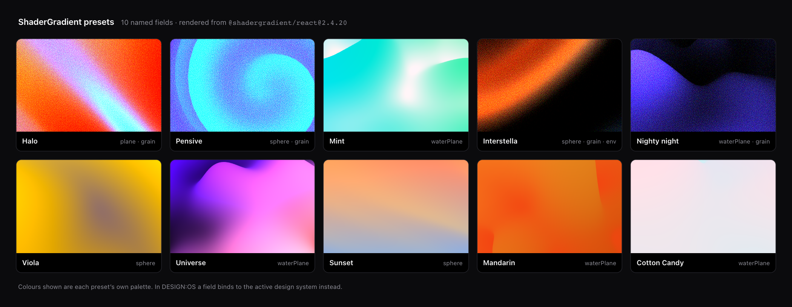

<sub>Rendered from the published renderer at the pinned version, each preset in its own
palette. In a real page a field's colours come from the active design system instead.</sub>

It is **gated, not offered**. A field is reachable only after
[the motion ladder](knowledge/motion-craft.md) selects T6 and the persona's motion cap
allows it — and it shares **one** per-viewport budget with the Canvas UI effect capability,
so a page gets one T6 surface, never one of each.


A field fails two independent ways, so it carries **two** fallbacks and shipping one as
though it were both is a reject:

| Trigger | Fallback | Why this one |
|---|---|---|
| `prefers-reduced-motion: reduce` | the same field, **frozen** | WebGL still works; the visitor asked for less motion, not a different design |
| no WebGL, or context loss | a **token-derived CSS gradient** | there is no canvas to freeze, and something must still light the surface |

No preset ships a static default, so the frozen state does not exist until it is wired —
`ui knowledge check` fails any matrix row whose fallback never names it.

The field's three colours are derived from design-system tokens, never carried over from the
preset. A canvas is invisible to `ui ds-usage-lint`, so nothing would catch a field that
quietly became the page's colour authority — which is exactly why it is a rule and not a
lint. Read the [gradient direction](knowledge/shader-gradient-direction.md) and
[runtime skill](templates/skills/shader-gradient.md).

---

## Your project gets a staff — the agents

One command turns the design system into a small team of **Claude Code
subagents**, each bound to the project's declared identity and scoped to exactly
one job:

| Agent | Name pattern | Does | Never does |
|---|---|---|---|
| **Designer** | `designer-<studio>-<project>` | generation & iteration on the project DS | scores its own work |
| **Curator** | `curator-<studio>-<project>` | critique, audits, verdicts with evidence | edits an artifact |
| **Figma hand** | `figma-<studio>-<project>` | canvas operations via `figma-agent`, drift-asserted | simulates when the plugin is down |

The prefix is generic on purpose — every DESIGN:OS project has *a* designer, *a*
curator, *a* figma hand — while the suffix carries the identity: a studio soul
named `MERIDIAN` on the project `meridian-store` yields `designer-meridian-meridian-store`.

### Set it up

```sh
ui ds soul init --studio    # once per MACHINE — your studio's stance; its name: names the agents
ui ds soul init             # once per PROJECT — the project's stance (or let /ui:learn draft it from evidence)
ui agents init              # writes .claude/agents/<role>-<studio>-<project>.md
```

Both souls start as `status: draft` scaffolds — fill **Never / Always / Voice**,
then set `status: ratified`. `ui ds soul check` (and `--studio`) lints the
structure. No studio soul yet? Agents still generate as `designer-<project>` and
the command tells you what you're missing.

### Use them

In Claude Code, delegate in plain words — *"ask the **designer** agent to build
the empty state for API Reviews"* — or just describe the task and let Claude
Code auto-route: each agent's description declares its scope, so build requests
find the designer and review requests find the curator.

**Identity is live, not baked.** Every agent's first action is `ui ds context`,
which carries the project soul (and the studio soul beneath it). Edit a soul —
the whole staff changes its taste at the next task, no regeneration needed. Only
the *names* are stamped at generate time.

**The roster is yours** — one agent or all three: `ui agents init --roster
designer,curator`. `ui agents list` shows what exists; `ui agents check` fails
(`agent-stale`, exit 1) on hand-edited or outdated files — heal with
`ui agents init --force`. Claude Code runtime only for now.

---

## The machine floor

Most design guidance is prose the model can talk itself past. The DESIGN:OS floor is
**code**: four core deterministic linters run on every HTML delivery, specialist gates cover
design-system usage and flow structure, and the rendered tier checks what static analysis cannot
see. A detected blocking breach cannot receive a `QUALIFIED` verdict.

| Layer | What it proves |
|---|---|
| `ui taste-lint` — 14 absolute checks | The generated-UI tells: `transition: all`, layout-property keyframes, missing reduced-motion, overshoot easing, italic display headings, uppercase line-height < 1, focus rings that fade in, z-index inflation, off-grid spacing, mixed icon sets… |
| `ui validate-layout` — 12 checks | Structural + overflow safety: unclosed tags, fixed-width overflow, `100vw` traps, root `overflow-x: hidden` breaking sticky. |
| `ui content-lint` — 10 checks | Honest copy: lorem-ipsum, placeholder copy, placeholder names (Jane Doe / Acme), click-here links, all-caps shouting. |
| `ui a11y-lint` + `ui ds a11y` | Tier-1 static WCAG checks + **token-pair contrast** (every `{role}/{role}-foreground` pair ≥ AA, hover/active states included). Never claims "compliant" — says exactly what it checked. |
| `a11y-audit` + `page-shot` + `ui vr` | The rendered tier: axe-core over live Chrome, deterministic PNG renders, pixel-level visual-regression gates per component (`design-os vr-matrix`). |

The pairing is structural: **every standard ships an emitter and a linter in the same
commit** — prose-only rules drift; enforced rules hold.

---

## Workflow map — current generation and learning loop

The host agent performs the design reasoning. The `ui` kernel validates artifacts and gates; it
never generates assets, calls a model, or accesses the network.

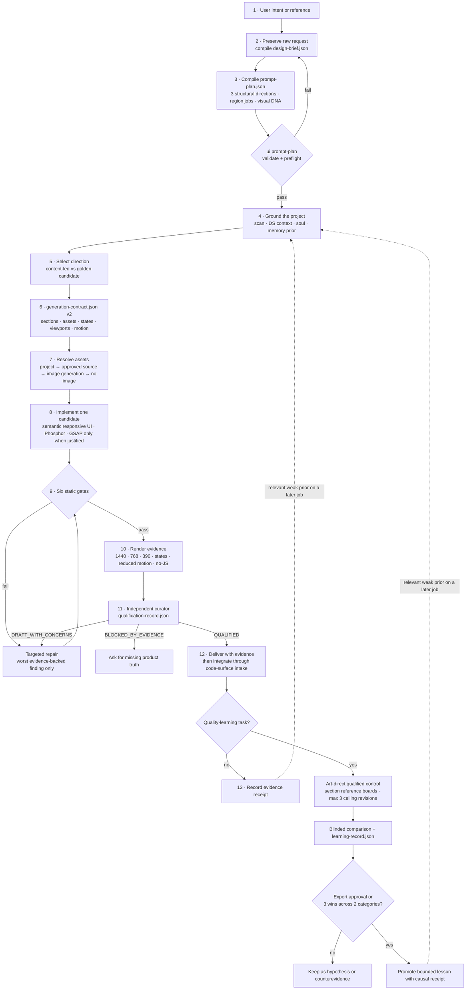
```mermaid
flowchart TD
    U["1 · User intent or reference"] --> B["2 · Preserve raw request<br/>compile design-brief.json"]
    B --> PP["3 · Compile prompt-plan.json<br/>3 structural directions · region jobs · visual DNA"]
    PP --> PF{"ui prompt-plan<br/>validate + preflight"}
    PF -- fail --> B
    PF -- pass --> G["4 · Ground the project<br/>scan · DS context · soul · memory prior"]
    G --> S["5 · Select direction<br/>content-led vs golden candidate"]
    S --> C["6 · generation-contract.json v2<br/>sections · assets · states · viewports · motion"]
    C --> A["7 · Resolve assets<br/>project → approved source → image generation → no image"]
    A --> I["8 · Implement one candidate<br/>semantic responsive UI · Phosphor · GSAP only when justified"]
    I --> SG{"9 · Six static gates"}
    SG -- fail --> R["Targeted repair<br/>worst evidence-backed finding only"]
    SG -- pass --> RE["10 · Render evidence<br/>1440 · 768 · 390 · states · reduced motion · no-JS"]
    RE --> Q["11 · Independent curator<br/>qualification-record.json"]
    Q -- DRAFT_WITH_CONCERNS --> R
    R --> SG
    Q -- BLOCKED_BY_EVIDENCE --> ASK["Ask for missing product truth"]
    Q -- QUALIFIED --> D["12 · Deliver with evidence<br/>then integrate through code-surface intake"]
    D --> EXP{"Quality-learning task?"}
    EXP -- no --> RCPT["13 · Record evidence receipt"]
    EXP -- yes --> AD["Art-direct qualified control<br/>section reference boards · max 3 ceiling revisions"]
    AD --> LR["Blinded comparison + learning-record.json"]
    LR --> PR{"Expert approval or<br/>3 wins across 2 categories?"}
    PR -- no --> HYP["Keep as hypothesis or counterevidence"]
    PR -- yes --> PROM["Promote bounded lesson with causal receipt"]
    RCPT -. "relevant weak prior on a later job" .-> G
    PROM -. "relevant weak prior on a later job" .-> G
```

The repair loop is capped at three attempts. Missing rendered evidence cannot become
`QUALIFIED`. Memory can influence a decision only as a cited weak prior; project truth, current
evidence, and the ratified soul outrank it.

### Entry surfaces and outputs

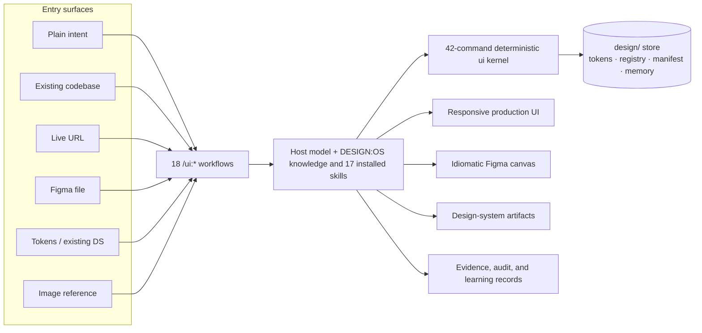
```mermaid
flowchart LR
    subgraph IN["Entry surfaces"]
      E1["Plain intent"]
      E2["Existing codebase"]
      E3["Live URL"]
      E4["Figma file"]
      E5["Tokens / existing DS"]
      E6["Image reference"]
    end
    E1 --> W["18 /ui:* workflows"]
    E2 --> W
    E3 --> W
    E4 --> W
    E5 --> W
    E6 --> W
    W --> H["Host model + DESIGN:OS knowledge and 17 installed skills"]
    H --> K["42-command deterministic ui kernel"]
    H --> O1["Responsive production UI"]
    H --> O2["Idiomatic Figma canvas"]
    H --> O3["Design-system artifacts"]
    H --> O4["Evidence, audit, and learning records"]
    K --> DS[("design/ store<br/>tokens · registry · manifest · memory")]
```

Brownfield work routes through `/ui:learn` before generation unless the user explicitly chooses a
fresh direction. Figma, rendered accessibility, screenshots, image generation, SVGL, GSAP, and
semantic recall remain optional hands used by the host workflow, not hidden dependencies of `ui`.

---

## The plugin — an agent and a designer in the same Figma file

<sub><b>1,675 tests green in its own repo</b> · four adversarial review rounds · a 200-target apply into a 10,000-record registry in ~1 ms</sub>

Every AI-on-Figma setup hits the same three walls. The agent's work collapses into **one
giant undo step** — press ⌘Z after twenty minutes of automated work and twenty minutes
disappear. The designer's own edits are **invisible to the codebase** — a human moves a
component, and the registry the agent builds from quietly goes stale. And when both act at
once, they **trample each other** — half-applied scripts, overwritten changes, no way to tell
what happened. This plugin exists to remove exactly those three walls.


### Your edits reach the codebase — the right codebase

Every change a designer makes is captured live and, after the file goes quiet, offered back as
one prompt: **"N changes ready — Sync now."** A click runs the deterministic kernel over the
ledger — no model sits in that path, so a sync is reproducible and auditable. And a sync cannot
guess where it goes: each Figma file is bound to **its** project once —

```sh
figma-agent bind --file "Design System v4" --dir ~/code/your-app
```

— and from then on that file's changes land in that project's registry, never in whatever
directory a process happened to start from. Unbound files stage safely and migrate on bind.
The confirmation never flatters itself: *"Synced — 3 added, 1 updated"* only when records were
actually written, *"Nothing synced"* when the run landed nothing, and a failure keeps the
prompt alive so the retry is still there.

### The agent cannot wreck your file

Every mutating operation seals **its own undo step** — ⌘Z rolls back one thing, not the whole
session. Arbitrary scripts run inside a bracket that **undoes itself on error**, and reports
`rolledBack: true` only when the rollback actually completed. Mutations are **jobs**: one runs
per file at a time, the rest queue in order, reads bypass the queue. A timeout tells you the
work was *not* cancelled and hands you a job id to poll; cancel actually cancels; a reply that
arrives after a job was killed is discarded, never served. Nothing is ever lost silently —
every eviction, prune, and rotation leaves a counter, an archive, or an audit record, and if
your project already owns a file the plugin wants (its own `component-registry.json`), the
kernel yields rather than co-opts. Every error lands in `design/figma-errors.jsonl` with its
full untruncated reason — a log written for the agent that caused it, so it can read and fix.

### Why this beats a write-only bridge

Most integrations write into Figma and stop. This one closes the loop in both directions — the
designer's hand edits flow back into the same registry the agent generates from, so drift is
detected and reconciled instead of accumulating — and it holds under load: per-file cursors and log rotation keep sync fast on
files with thousands of components (a 200-target apply into a 10,000-record registry measures
about a millisecond), and the panel reports only what actually happened — a name appears in
the activity feed only when the reply carried one, a count only when one parsed. The whole
thing shipped through four adversarial review rounds in which every blocker was reproduced
before it was believed, and each fix carries a test that fails against the previous code.

This plugin now ships as its own repo — **[design-os-figma-plugin](https://github.com/jangtrinh/design-os-figma-plugin)**
— so it can version, release, and take contributions independently of this kernel. Install,
build, and bind instructions live there; this section stays as the introduction to *why*
it exists.

---

## The Figma hand

`figma-agent` drives a Figma plugin over a local self-healing broker: reconnect back-off,
heartbeats, a park queue that holds commands through a broker respawn, and a multi-file
registry — full detail in the [plugin repo's own README](https://github.com/jangtrinh/design-os-figma-plugin).

Four moves, both directions:

- **Read** — `design-os figma scan` exports components/variables/styles;
  `ui ingest-figma-ds` turns them into tokens + registry + DESIGN.md.
- **Audit** — `design-os figma audit` runs ten deterministic DS-hygiene detectors over
  the open file's component library — a raw one-pass scan that survives 160k-instance
  files, judged entirely in fixture-tested CLI code.
- **Write** — `/ui:to-figma` authors idiomatic canvas: auto-layout, real instances,
  token-bound variables, drift-asserted geometry.
- **Mirror** — `design-os figma reconcile --apply` keeps each component's registry record
  a **1:1, rebuildable reflection** of its Figma node — the same buildable representation
  the write path draws *from*. `figma-agent mirror-verify <nodeId>` proves the round-trip
  is a **fixed point** (`equal: true`); what Figma's API genuinely won't let a rebuild carry
  is recorded and reported, never silently dropped. Verified live on a production 27-screen
  design system: 9/9 diverse components round-trip to `equal: true`.

That last move makes the whole thing a **verification loop for authoring**: any draw can be
checked by round-trip — draw → scan → diff against intent — so "what I drew == what I meant"
stops being a matter of eyeballing.

Kept deliberately *out* of the `ui` binary (it needs a network and a live plugin, and now a
separate install). Fall back to `/ui:generate` (HTML) any time the hand is unavailable.

**Why a CLI hand, not (just) the Figma MCP, in one line:** the official MCP is built to pull
a design *into the conversation*; the hand is built to operate *on the file* — deterministic
and scriptable (one command → one JSON envelope → stable exit codes), engineered for heavy
files (chunked transport, warm retry), multi-file and pinnable (`FIGMA_AGENT_FILE`), no seat
or OAuth. The MCP is still the right tool for implementing a *selected frame* as code or a
quick zero-setup read; full reasoning lives in the plugin repo's README.

---

## The review loop — a comment becomes work, and the owner closes it

A design review is instructions scattered across pins. `ui figma comments` turns that into a
worklist and then reads back whether the work was accepted — the two ends the hand above does
not cover. It is a pure transform over REST payloads the host captured (Figma's Plugin API
cannot read comments at all), so it stays inside the deterministic kernel.

- **Triage** — replies fold into threads, resolution is judged per thread, and every pin
  resolves to a page/frame/ancestor chain with an honest confidence label
  (`element` · `region` · `frame` · `orphaned` · `unanchored`). **It refuses rather than
  guesses:** the anchor never returns the deepest containing node, because in real
  auto-layout that is routinely a full-bleed background rect or a spacer, and a confidently
  wrong element name is worse than none. A fixture provokes that exact case; a test pins the
  refusal.
- **Sync** — `--since` reports the delta over a prior pull across four states, one of which
  exists because `resolved_at` is ambiguous: it means *"my request is satisfied"* from a
  reviewer but only *"I have read this"* from someone answering in their own thread. A reply
  inside an already-resolved thread is still a live instruction — it measured **6** on a real
  file where the default view reported **0**.
- **Verdict** — completion is read off the owner's own reply as
  `accepted` · `conditional` · `reversed` · `silent`, not derived from the implementer.
  Silence is its own verdict and never acceptance; ambiguity biases to `conditional`, because
  a wrong conditional costs one question and a wrong `accepted` ships a defect.

Measured on a live 1,819-message product file: 45/45 comments reached `element` confidence
with zero orphaned and every count reconciling against the total pulled; of 42 verdicts
**20 were not a clean yes, and four were recorded nowhere** — including 7 threads resolved in
silence that a boolean "done" flag had been reading as yes.

`--delivery-target` is required rather than defaulted, because the most expensive error
measured was a batch aimed at the wrong artifact that then passed every gate defined for the
wrong one. The doctrine behind all of this is written down once, in
[`knowledge/verification-honesty.md`](knowledge/verification-honesty.md): a checker must be
able to **refuse**, totals must reconcile against what entered the pipeline, a status flag
carries its *setter's* meaning rather than the reader's, and silence must be its own state
instead of falling into the accepting branch.

---

## The surfaces

| Surface | Path | What it is | Tests |
|---|---|---|---|
| **`ui` kernel** | `src/` | 42 deterministic commands — prompt-plan and delivery validation, DS compile/mutate/preview, tokens, OKLCH color math, static gates, VR, memory, evidence. Zero runtime dependencies, no network, no model calls. | 3,430 |
| **`design-os` conductor** | `design-os/` | Python/Typer umbrella that composes everything: `doctor` · `audit` · `heartbeat` (deterministic design-health rhythm — due/compare/notify, zero model calls) · `reference` · `vr-matrix` · `figma status/scan/audit` · `update` (one-command toolchain refresh on any machine) · entry-point plugins. Re-emits every underlying envelope **verbatim** — one source of truth per verdict. | 312 |
| **`figma-agent` hand** | [external repo](https://github.com/jangtrinh/design-os-figma-plugin) | CLI + WS broker + Figma plugin: canvas authoring, DS scan, the 10-detector hygiene audit, exec-js, capture. Split out so it can version independently of this kernel. | 1,675 (own repo) |
| **rendered-tier hands** | `a11y/` | `a11y-audit` (axe-core over installed Chrome — wording never claims "compliant") + `page-shot` (deterministic full-page PNG). | — |
| **`recall` mind** | `recall/` | Optional semantic memory: local embeddings (MiniLM/ONNX, nothing leaves the machine), hybrid RRF ranking, `query → …work… → reflect` loop. The kernel never imports it — a test fails the build if it does. | — |
| **`knowledge/` core** | `knowledge/` | The model-facing brain: 6+1-axis taste rubric, 26 personas / 7 families, page-structures (21 shapes + diversification + honest copy), two-tier a11y model, color science, token taxonomy, `figma-craft/` construction tree. | — |

<details>
<summary><b>All 42 <code>ui</code> commands</b></summary>

| Command | Summary |
|---|---|
| `ui guide` | Plain-language map of the `/ui:*` workflow (**start here**) |
| `ui schema` | Machine-readable signatures for every (sub)command |
| `ui doctor` | Verify an install (and, with `--cwd`, a project) is healthy |
| `ui onboard` | First-run readiness checklist — adapters, git, DS, soul, learning loop |
| `ui scan` | Detect existing design signals — routes brownfield projects to `/ui:learn` |
| `ui init` | Write the manifest + per-runtime adapter tree |
| `ui ds` | Compile/inspect/mutate the DS (`init`/`import`/`context`/`change-token`/`status`/`diff`/`docs`/`a11y`/`specimen`/`preview [--split]`) — `init` compiles the 27-component paired-token kit |
| `ui tokens` | Compile a DTCG token file to CSS / Tailwind / Figma variables |
| `ui color` | OKLCH color math: convert, scale, contrast, semantic palette |
| `ui taste-lint` | 14 absolute taste checks across 6 axes |
| `ui validate-layout` | 12 structural/overflow checks |
| `ui tenant-lint` | Enforce the Tenant Law on embeddable motion sections (scroll-scrub, parallax, exploded view) |
| `ui tenant-scaffold` | Emit the canonical scroll-scrub tenant engine verbatim |
| `ui content-lint` | 10 honest-copy checks |
| `ui a11y-lint` | Tier-1 static WCAG checks (not a conformance claim) |
| `ui ds-usage-lint` | Enforce use of the project's own tokens and components |
| `ui audit` | Deterministic DS-violation audit of a structured node export (5 families) |
| `ui critique-coverage` | Acceptance-criteria coverage of a produced design |
| `ui flow` | Lint a multi-screen flow's IA graph |
| `ui chart` | Lint self-contained chart artifacts deterministically |
| `ui diagram` | Lint self-contained diagram artifacts deterministically |
| `ui vr` | Visual-regression diff/gate (zero-dep PNG codec + pixelmatch) |
| `ui evidence` | User-evidence ledger with an anti-fabrication gate |
| `ui memory` | Design-decision ledger → compiled graph → cross-project taste profile |
| `ui changelog` | Fold DS history into a readable changelog |
| `ui ingest-figma-ds` | Onboard a scanned Figma DS (ds.json → tokens + registry + DESIGN.md) |
| `ui ingest-css-ds` | Compile CSS custom properties into portable design tokens |
| `ui figma` | Reconcile Figma change logs into the component registry; `comments` triages a captured comment payload into anchored threads and reads the owner's verdict |
| `ui synthesize-conventions` | Learn applied conventions from real screens |
| `ui taste` | Ingest pairwise taste evidence and compute study verdicts |
| `ui agents` | Generate and verify project-scoped designer, curator, and Figma agents |
| `ui knowledge` | Check knowledge-core indexing, provenance, and cross-reference drift |
| `ui delivery` | Validate briefs, generation contracts, qualification records, and learning records |
| `ui prompt-plan` | Validate and preflight prompt-plan orchestration contracts |
| `ui designmd` | Extract tokens, snapshot, audit DESIGN.md folders |
| `ui registry` | Component registry store: register, lookup, list |
| `ui edit-strategy` | Select edit strategy, number lines, apply ln-diff patch |
| `ui autofix` | 5 deterministic HTML fix rules |
| `ui export` | Export HTML as a standalone self-contained file |
| `ui strip-fences` | Remove fences + stray prose around LLM HTML |
| `ui parse-json-stream` | Extract concatenated JSON objects from a stream |
| `ui gflow` | Drive the gflow scroll-cinema asset pipeline (footage → frame tiers) |

</details>

---

## How the loop works, mechanically

1. **You describe intent** → `/ui:generate landing page for a new gym`.
2. **Intent compiles** — the raw request becomes a provenance-tagged brief and a validated
   prompt plan with three structural directions, explicit region jobs, and visual DNA.
3. **The project grounds the decision** — current DS, soul, evidence, and memory context load;
   current product truth outranks recalled preference.
4. **Direction and assets resolve before code** — content-led and golden candidates are compared;
   icons, logos, imagery, states, responsive transformations, and motion receive explicit roles.
5. **One candidate earns delivery** — six static gates run first; desktop/tablet/mobile and
   behavioral renders feed an independent curator.
6. **Repair stays bounded** — only the worst evidence-backed finding is repaired per round, for
   at most three attempts, with affected gates and renders rerun.
7. **Status stays honest** — only clean evidence emits `QUALIFIED`; unresolved work remains
   `DRAFT_WITH_CONCERNS` or `BLOCKED_BY_EVIDENCE`.
8. **Learning needs causality** — evidence, application, artifact, and outcome form a receipt.
   Quality-learning tasks preserve controls, use blinded comparison, and promote a lesson only
   after expert approval or repeated wins across categories.

---

## Changelog

The recent wave, newest first — full history in [CHANGELOG.md](CHANGELOG.md).

| Date | Change | Commit |
|---|---|---|
| 2026-08-20 | **`ease-design@0.5.0`** — the native-expert release: need→verb routing knowledge + the untaught-feature parity gate, pointing agents with the knowledge anchor, `ui init --with-agents`, and an 84-prompt blind benchmark that measured the doctrine to a fully clean board | `v0.5.0` |
| 2026-08-20 | **Routing board clean** — the three canvas-cell misses adjudicated at their sources (`design.md` frontmatter regains the canvas condition; G2 gains the decision-vs-construction tie-break): one moved by doctrine and measured, two corrected labels; re-measured with no collateral flips | `#207` |
| 2026-08-20 | **`ui init --with-agents`** — opt-in roster generation in the same init run (claude runtime + existing project DS required; pre-flights to `DS_NOT_FOUND` before any write) | `#205` |
| 2026-08-20 | **Routing doctrine, measured** — an 83-prompt blind benchmark (authored from frontmatter only, routed by context-clean agents) caught two doctrine bugs at must-ask 58%; after the fixes a 16-prompt reference-path re-run graded 16/16, putting the merged figures at verb 96% / must-ask 100% / composite 100% / 0 taste interrogations | `#206` |
| 2026-08-20 | **Native-expert agents** — `knowledge/need-routing.md` turns a stated need into the right design:os application (19-verb decision gates, three sanctioned asks, the composition rule); two-way parity checks make an untaught new capability a red build, and a per-role allowlist keeps agent templates pointing instead of enumerating (born-red on the real designer drift) | `#203` |
| 2026-08-19 | **`ease-design@0.4.0`** — the tractability release: 14 floors, 4 floor repairs, `ui gate` + coverage registry, FloorFinding schema v1, telemetry events, and a measured −65% error-at-birth from born-passing knowledge | `v0.4.0` |
| 2026-08-19 | **font-display gets its repair** — the one floor the born-passing A/B showed teaching cannot move (6→6 across arms) becomes an autofix: `@font-face` gains `font-display: swap`, Google-Fonts hrefs gain `display=swap`; 12→0 on the A/B corpus in one pass | `#200` |
| 2026-08-19 | **Tractability telemetry events** — the ledger learns `route_decided`, `attempt_completed`, `outcome_recorded` (accept REQUIRES the final gate verdict with provenance refs) and `taste_veto` (file + mandatory reason; the stream the FP gauge and librarian recurrence will read) — the labeled-loop data the moat thesis lives on | `#199` |
| 2026-08-19 | **FloorFinding schema v1 + `ui gate coverage`** — findings gain declared repair fields (`expected`/`actual`/`fixHint`/`repairScope`) and the gate grows a coverage registry (88 checks, per-project activity, paired against the sources AND against runtime emission) — the evidence base for tractability routing and strict patch validation | `#198` |
| 2026-08-19 | **One composed judge: `ui gate`** — every HTML-emitting workflow (and the critique funnel itself, which was silently missing a11y+content) now judges through one command composing all four linter families plus an autofix dry-run; skips must carry declared reasons, a coverage test keeps future workflows honest, and wiring the goldens exposed and fixed a `fixDuplicateIds` false positive on `data-*-id` attributes | `#197` |
| 2026-08-19 | **The floors repair themselves** — `ui autofix` wraps unguarded `:hover` in `@media (hover: hover)`, injects `tabular-nums` on numeric tables, and restores killed focus rings, each repair gated by its own linter check and confirmed silent after; generation-craft-defaults now teaches the floors up front so variants are born passing | `#195` |
| 2026-08-19 | **Three more floors: labels, focus rings, concentric corners** — `input-unlabeled` + `focus-outline-removed` (a11y errors, WCAG 3.3.2/2.4.7), `equal-nested-radii` (taste warning; the concentric rule finally gets its linter), and the critique workflow walks every state, slows motion to 10%, and reports considered-but-rejected fixes instead of padding suggestions | `#193` |
| 2026-08-19 | **Kit typography polish** — kit titles set `text-wrap: balance`, bodies `text-wrap: pretty`, the Avatar photo carries a token-driven 1px hairline outline, breadcrumb underlines clear descenders (`from-font` + `skip-ink`); a kit floor test pins every declaration so a reverted emitter goes red | `#192` |
| 2026-08-19 | **The repo's own surfaces meet the punctuation floor** — the site and guide slides pass `content-lint` clean (typographic apostrophes, curly quotes, the CSS snippet marked up as `<code>`); `data-numbers-not-tabular` validated on 1,071 real files (3 genuine designed-UI positives) and its date-column behavior recorded as a decision | `#191` |
| 2026-08-19 | **Five interface-craft floors from the interfaces.dev cheat sheet** — smart punctuation and verb-first button labels in `content-lint`, blocked-paste detection in `a11y-lint` (error, WCAG 3.3.8), unguarded `:hover` on mobile-intent documents in `validate-layout`, and missing tabular figures on numeric tables in `taste-lint`; the kit's Button/Breadcrumb hover rules now sit behind `@media (hover: hover)` so the kit passes its own new floor | `#189` |
| 2026-08-17 | **Onboarding points at the plugin repo when the Figma agent is absent** — the Figma next step said `figma-agent status` on every machine, which is a `command not found` unless the separately-shipped Design Agent is installed; a PATH probe now picks the right sentence | `#187` |
| 2026-08-16 | **Root rules are decided by the selector's subject** — `root-overflow-x-hidden` matched the root name anywhere in the selector, so `body.dark .card { overflow: hidden }` was false-flagged as a root rule; the colour-mode scan behind `mode-invisible-surface` shared the defect. Both now read one `selectorSubjectIsRoot` helper, so repairing one cannot leave the other broken | `#183` |
| 2026-08-16 | **The scrub-encode floor gets its emitter** — `ui scrub-scaffold` writes the `build-assets.sh` that produces a clip meeting the floor `ui scrub-lint` enforces; both halves read one definition, so a knob cannot change on one side only. The portrait profile encodes narrower *and* with a tighter GOP, and refuses to centre-crop a landscape source instead of cropping silently | `#179` |
| 2026-08-16 | **`ease-design@0.3.0` on npm** — the kernel release catches up with the showcase: all 42 commands including `tenant-scaffold`/`tenant-lint` (the scroll engine behind the demo grid), `gflow`, `chart`, `diagram`, `onboard`; published from CI with sigstore provenance | `v0.3.0` |
| 2026-08-16 | **A design review becomes work, and the owner says when it is done** — `ui figma comments` folds a captured REST payload into threads and resolves each pin to a page/frame/ancestor chain with an honest confidence label, refusing to name an element rather than guessing a background rect; `--since` reports replies inside already-resolved threads (6 on a real file where the default view showed 0); and completion is read off the owner's own reply as `accepted / conditional / reversed / silent` instead of derived from the implementer — on a live 1,819-message file, 20 of 42 verdicts were not a clean yes and four were recorded nowhere | `#164` |
| 2026-08-16 | **Gradient fields, rendered** — the ten ShaderGradient presets now appear in the README as a labelled grid plus an animated field, rendered from the published renderer with this repo's own preset values; the ledger's package version is corrected to one that was actually released | `#157` |
| 2026-08-16 | **ShaderGradient as a T6 gradient-field capability** — `/ui:generate`/`/ui:refine`/`/ui:redesign` can direct one animated 3D gradient field behind the existing T6 gate, sharing `canvas-effect`'s single-effect budget; a source-free ledger pins the preset roster and surface set, `ui knowledge gradient-matrix` emits the matrix's machine columns, and `ui knowledge check` fails a fallback cell that never names the frozen state | `#156` |
| 2026-08-15 | **Native diagram craft** — `/ui:diagram` routes architecture, sequence, and product-flow intent into accessible offline SVG; `ui diagram lint` enforces owned-artifact structure and product-flow source metadata; a pinned real-flow proof verifies every source ID and an empty fidelity ledger before release | `#132` |
| 2026-08-13 | **Four shipped sites lead the showcase as a grid** — [OPAH ONE](https://github.com/jangtrinh/design-os-drone-showcase), [AURA](https://github.com/jangtrinh/aura-scrollcinema-demo), [Robotic Arm](https://github.com/jangtrinh/design-os-animejs), and [Rill Architecture](https://github.com/jangtrinh/design-os-rill-architecture) (now its own public repo + Pages) open the README as a two-column grid of scroll-throughs; each repo documents how to reproduce it with DESIGN:OS and carries its own demo recording (gif + mp4) | `5e2e499` |
| 2026-07-31 | **figma-agent split into its own public repo** — the Figma plugin + CLI now lives at [design-os-figma-plugin](https://github.com/jangtrinh/design-os-figma-plugin), versioned and released independently of this kernel; `setup.sh`/`design-os update`/CI no longer build or link it as an in-repo workspace, and this README's Figma-hand section collapses to an introduction + pointer | `ed33a22` |
| 2026-07-31 | **The designer's edits become readable history** — `figma-agent changes` narrates the owner-edit feed per file in human sentences and `figma-agent errors` reads the error log without ever crashing on a bad line; reconnect gap-fill reports edits made while the plugin was closed (deleted pages get one honest notice; over-cap pages suppress their diff rather than emit false facts); the edit feed now routes through the file↔project binding so a file's history can never land in another project | `8902584` |
| 2026-07-31 | **Concurrency & Jobs** — one mutation per Figma file at a time (broker-side per-file FIFO; read-only traffic bypasses), every mutation is a job with an id: a CLI timeout names the job and `figma-agent job <id>` polls the real outcome instead of blind re-dispatch; cancel actually cancels and a disconnect-failed job can never be resurrected; panel Activity now narrates sync runs in full sentences and stuck rows time out honestly. Proven by an in-process daemon harness over the seams unit tests could not see | `5f79672` |
| 2026-07-30 | **Registry Integrity wave** — a Figma file's changes land in ITS bound project (`figma-agent bind`), never the broker's spawn directory; per-file `{line,byte}` cursors with streaming reconcile + 8 MiB log rotation (truncation is never a silent advance); sharded registry storage with a byte-identical contract file; map-based apply (~1 ms for a 200-target apply into 10k records); a project's own `component-registry.json` is never touched (kernel yields to `figma-component-registry.json`); every eviction/prune/rotation leaves a counter, archive, or audit record. Two empirical stage-4 review rounds, 86+ new tests | `c9ab3ff` |
| 2026-07-25 | **Scroll-cinema toolchain is now visible at bootstrap** — `design-os doctor` checks `gflow`/`ffmpeg`/`cwebp` as optional hands (absence reported up front, not discovered mid-generation after credits are spent), and `setup.sh` gained an **opt-in** gflow step that explains the account risk and asks (`--with-gflow`/`--no-gflow`; non-interactive runs skip). `_probe_version` keeps the first line only, so `ffmpeg`'s multi-line build banner can't flood the envelope. Spec 021's `SPEC.md` reconciled: Architecture A confirmed as the owner's order, LOCKED DIRECTION marked superseded, status split (tenant half shipped / asset half pre-integration) | `0039975` |
| 2026-07-25 | **Tenant contract — embeddable motion sections** — `ui tenant-lint <page>` enforces the Tenant Law (a scroll-scrub/parallax/exploded-view section READS the host only via its own bounding box, WRITES only its own subtree; fails global writes + sticky-killer ancestors, follows linked `src`/`href` files); `ui tenant-scaffold <dir>` emits the canonical scrub engine verbatim. `knowledge/motion-craft.md` gains the contract, `generation-craft-defaults.md` a canvas-aspect floor | `a394230` |
| 2026-07-22 | **Full-studio one-command setup (Spec 020)** — `./setup.sh`: prereqs → `npm install` → build (ui + figma-agent/recall/a11y, a11y last) → link all 5 bins → `uv tool install` the design-os umbrella → verify (`ui doctor` + `design-os doctor`) → style-A report; idempotent, `--check`/`--skip-python` flags. README swaps the old dev note for a "Full studio (clone)" subsection | `7132637` |
| 2026-07-22 | **Published to npm** — `npm i -g ease-design` (v0.1.0, MIT, zero deps); first public release from CI with sigstore provenance. Kernel-only; Figma/recall/a11y hands ship separately later | `281fc55` |
| 2026-07-21 | **Report renderer + preview links (Spec 019 P2)** — style-A (`ruleHeader`/`checkItem`/`kv`) adopted in `ui doctor`, `ui ds preview`, `ui designmd audit`, `design-os doctor`, `design-os evolution`; new OSC-8-safe `previewLink`/`figmaNote` convention (bare `file://` paths, never markdown links); Python mirror `report_style.py`. `--json`/exit codes unchanged | `7ea1429` |
| 2026-07-21 | **Onboarding first-run (Spec 019 P1)** — `ui onboard` readiness checklist (adapters, git, DS, soul, learning loop + optional agents/Figma), a shared style-A report renderer, `ui init` chaining to `onboard`/`guide`, and host-approval-before-install discipline wired into the `/ui:init` wrapper + onboard journey | `61f35a7` |
| 2026-07-21 | **Suite-level IMPROVING gate** — the living-agent proof graduates only from a preregistered suite (≥3 holdouts across ≥2 categories, mean +10, aggregate repair/recurrence reductions, every case wins); a single comparison can no longer graduate and a 0→0 metric no longer reads as 100%. Verdict stays `APPLIED` | `591016c` |
| 2026-07-21 | **Interaction boundary benchmark** — animated DESIGN:OS, native-mobile Nutrition, and premium Architecture treatments with desktop/mobile renders and honest claim boundaries | `b706b8e`…`f1ee62f` |
| 2026-07-21 | **Official GSAP motion skill** — advanced web choreography, ScrollTrigger, lifecycle cleanup, plugin restraint, reduced-motion and performance evidence; adapted from GreenSock's MIT skill suite | `982c30b` |
| 2026-07-19 | **Qualified Delivery (Spec 014 P0)** — weak prompt → provenance-tagged brief → generation contract → canonical renders → bounded repair → honest delivery status; `ui delivery validate` blocks false `QUALIFIED` verdicts | `59686cd` |
| 2026-07-16 | **Figma mirror (1:1)** — each component's registry record is a rebuildable reflection of its Figma node; `mirror-verify` proves the scan→rebuild→scan **fixed point** live (bindings by publish key, instances, variant swaps, inner overrides), `equal:true` across a real 27-screen DS. Plus a per-operation activity feed in the plugin panel | `b9b7255`…`7959464` |
| 2026-07-16 | **Figma live-sync** — `documentchange` → append-only ledger → 5-min idle → 1-click panel Sync → `reconcile --apply`; the registry follows the canvas near-real-time | `#34`…`#38` |
| 2026-07-15 | **Journey skills** — `design-os-{onboard,daily,deliver}`: the full user journey as three installable skills (entry router, audit disambiguation, delivery playbook), all skills renamed `design-os-*`, command-consistency + drift linters | `fc4adee` |
| 2026-07-15 | **Souls speak English** — character-over-cosmetics doctrine; scaffolds EN; factory→studio→project chain live on a real project | `cc1a56c` |
| 2026-07-15 | **Factory soul** — the world-class baseline stance design:os ships day-0; user souls override clause-by-clause | `6183662` |
| 2026-07-14 | **Agents**: role-first naming (`designer-<studio>-<project>`) — generic prefix to delegate by, genealogy suffix for identity | `f41dfb2` |
| 2026-07-14 | **`ui agents`** — soul-bound, task-scoped project agents (designer · curator · figma-hand) with template-hash drift check | `fe1eda3` |
| 2026-07-14 | **`ui taste`** — vote-driven taste corpus: ingest (sha256+dHash dedup), pairwise Elo ranking, study ledger | `8cf2bfd` |
| 2026-07-14 | **`brand/`** — the studio's own DS store + the first evidence-cited design soul | `cf7c46b` |
| 2026-07-14 | **`ui ds soul --studio`** — the studio identity layer above every project soul; names the agents | `8ef3a28` |
| 2026-07-14 | **`design-os heartbeat`** — deterministic design-health rhythm: due-scheduled checks, DESIGN_OK contract, delta gating | `57224b3` |
| 2026-07-14 | **`ui ds soul`** — declared design stance (`design/soul.md`): scaffold, 6-check structure floor, context injection, 9 workflow gates | `daa6c82` |
| 2026-07-14 | **`design-os figma audit`** / `figma-agent audit-ds` — automated DS-hygiene audit (v2: ds/icon/screen segmentation, variant-aware detectors, offline replay) | `c1e676b`…`7a3a20d` |
| 2026-07-14 | **DESIGN:OS** — rebrand + repo rename; live-product demo gallery; README workflow map | `2f28e80` |
| 2026-07-14 | **Slop gates** — 8 deterministic anti-generated-UI checks across taste/layout/content linters + `knowledge/page-structures.md` | `28f027e` |
| 2026-07-13 | **Figma plugin** — self-healing multi-file broker, brand panel (compact-first), connection stability | `55ec6f3`…`a6c90e3` |
| 2026-07-13 | **27-component kit** — `ds init` compiles a full paired-token component library out of the box | `30fd579`…`7e24258` |

---

## Status & honest boundaries

**Dogfooded on real work, not fixtures:** a production Figma project (129-component
library scanned, audited, reconciled), a full brand pipeline (reference intake → DNA →
compiled brand DS → the plugin panel you see above, contrast machine-corrected), the
toolchain's own preview/specimen surfaces, and the **1:1 mirror verified live** on a
production 27-screen design system (9/9 diverse components round-trip to `equal: true`;
every remaining gap was a real bug caught on the live canvas, not a fixture).

Still open, stated plainly:

- **Qualified Delivery calibration** — the deterministic contract, prompt-plan orchestrator,
  D01-D03 development contracts, art-direction learning record, and known-bad false-green fixtures
  ship across marketing and product surfaces. The first orchestrated-only repeatability study
  reached 8.96/10 across nine untouched runs, but deterministic audit still found two mobile
  overflow failures and repeated binary-rule misses. A post-generation repair gate, human reviewer
  agreement, and broader dashboard/app/flow corpora remain before any repeatable “world-class”
  claim.

- **`figma-agent audit-ds` live acceptance** — unit-tested + fixture-proven; the
  ground-truth comparison against a hand-classified 129-component audit runs on the next
  plugin reload.
- **`/ui:to-figma` canvas E2E** — the write path is now **live-verified by the mirror
  round-trip** (`mirror-verify` returns `equal: true` on real components); a full
  intent→canvas run authored from a plain-language prompt on a fresh file is the last
  piece still being filmed for the docs.
- **Taste-rubric threshold calibration** — the ≥7 per-axis cutoff is a reasoned default;
  tuning against a labeled corpus is future work. The deterministic floor already removes
  the worst failure mode.

---

## Contributing

Four gates stay green (`typecheck` · `lint` · `build` · `test`), the `ui` kernel stays
zero-runtime-dependency and deterministic, and **every new standard ships its emitter and
its linter in the same commit**. See [CONTRIBUTING.md](CONTRIBUTING.md) and
[CHANGELOG.md](CHANGELOG.md).

## License

MIT — see [LICENSE](LICENSE). The gate is the product; the taste is yours.
